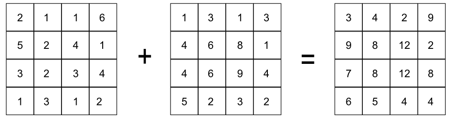

.. _processing.processes.raster.addcoverages:

.. warning:: Document Status: **Requires example and some questions answered (MP)**

AddCoverages
============

Description
-----------

The ``gs:AddCoverages`` process takes two input grid coverages and performs a cell-by-cell addition on them, generating a new grid coverage. Each cell in the output grid has the value resulting from the addition of the corresponding values for that same cell in the input grids. Coverages are assumed to have a single band. If multiband layers are entered, only the values in the first band will be used.

   *gs:AddCoverages*

Inputs and outputs
------------------

This process accepts :ref:`processing.processes.formats.rasterin` and returns :ref:`processing.processes.formats.rasterout`.

Inputs
~~~~~~

.. list-table::
   :header-rows: 1

   * - Name
     - Description
     - Type
     - Usage
   * - ``coverageA``
     - First input coverage
     - :ref:`GridCoverage2D <processing.processes.formats.rasterin>`
     - Required
   * - ``coverageB``
     - Second input coverage
     - :ref:`GridCoverage2D <processing.processes.formats.rasterin>`
     - Required    

Outputs
~~~~~~~

.. list-table::
   :header-rows: 1

   * - Name
     - Description
     - Type
   * - ``result``
     - Output grid coverage
     - :ref:`GridCoverage2D <processing.processes.formats.rasterout>`

Usage notes
-----------

* Both input coverages must have the same bounding box and the same cell size. That means they must have the same width and height (in cells), so that their cell locations match exactly.
* The output coverage will have the same bounding box and cell size as the input.

.. todo:: Example needed.

Related processes
-----------------

* The :ref:`gs:MultiplyCoverages <processing.processes.raster.multiplycoverages>` process performs a similar operation, multiplying cell values instead of adding them.

