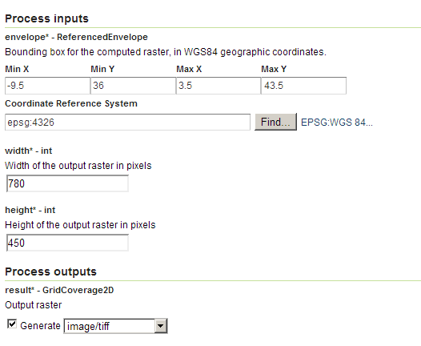
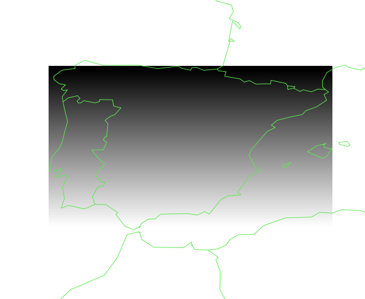

.. _processing.processes.raster.areagrid:

.. warning:: Document Status: **Requires images and questions answered (MP)**

AreaGrid
========

Description
-----------

The ``gs:AreaGrid`` process creates a new grid coverage with a given bounding box and cell size, where each cell contains as its value the area it occupies.

.. todo:: Image file missing: img/areagrid.png

Inputs and outputs
------------------

This process accepts :ref:`processing.processes.formats.rasterin` and returns :ref:`processing.processes.formats.rasterout`.

Inputs
~~~~~~

.. list-table::
   :header-rows: 1

   * - Name
     - Description
     - Type
     - Usage
   * - ``envelope``
     - Bounding box to be used for the resulting raster, in WGS84 geographic coordinates.
     - ReferencedEnvelope
     - Required
   * - ``width``
     - Width of the resulting grid coverage, in cells
     - Integer
     - Required    
   * - ``height``
     - Height of the resulting grid coverage, in cells
     - Integer
     - Required

.. todo:: WPS request builder says width/height in pixels, not cells. Which is it?

Outputs
~~~~~~~

.. list-table::
   :header-rows: 1

   * - Name
     - Description
     - Type
   * - ``result``
     - The output grid coverage with area values
     - :ref:`GridCoverage2D <processing.processes.formats.rasterout>`

Usage notes
-----------

* The input envelope is assumed to use WGS84. If the input envelope uses a different CRS, that information will be ignored, and only the coordinates will be used.
* The output grid coverages will have a CRS of WGS84.
* Area values are expressed in square meters.
* Areas are calculated by reprojecting the original WGS84 coordinates of each cell boundary into an `Eckert IV <http://en.wikipedia.org/wiki/Eckert_IV_projection>`_ projection.

.. todo:: In WPS request Builder, CRS is an option for envelope. If it's being ignored, is this a bug?

.. todo:: Eckert IV? Why?

Examples
--------

Calculating areas for a grid coverage of 1-minute cells 
~~~~~~~~~~~~~~~~~~~~~~~~~~~~~~~~~~~~~~~~~~~~~~~~~~~~~~~~

The following example creates an area grid that covers the territory of peninsular Spain, with a cell resolution of 1 minute (1/60 of a degree).

.. todo:: How is the above calculated and turned into the following parameters?

Input parameters:

* ``envelope``: 

  * ``minX``: -9.5
  * ``minY``: 36
  * ``maxX``: 3.5
  * ``maxY``: 43.5
  * ``CRS``: ``EPSG:4326`` 

* ``width``: 780
* ``height``: 450

:download:`Download complete XML request <xml/areagrid.xml>`.

   *gs:AreaGrid example parameters*

   *gs:AreaGrid example output*

.. todo:: What is this image supposed to show? Where are the areas?

