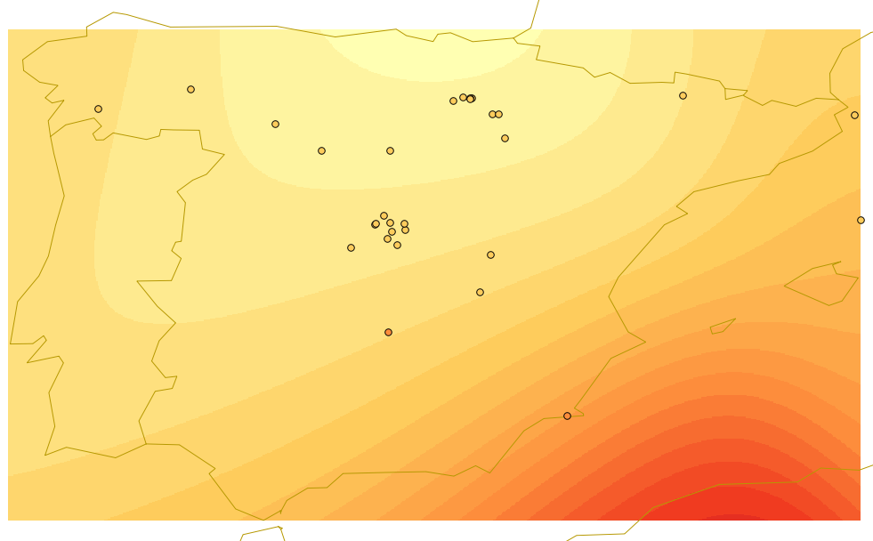

.. _processing.processes.raster.barnessurface:

.. warning:: Document Status: **Requires additional technical review and example (MP)**

BarnesSurface
=======================

Description
-----------

the ``gs:BarnesSurface`` process computes an interpolated surface over a set of irregular data points. Surface values are computed using the `Barnes interpolation algorithm<http://en.wikipedia.org/wiki/Barnes_interpolation>`_. 

.. figure:: img/barnessurface.png

   *gs:BarnesSurface*

Inputs and outputs
------------------

``gs:BarnesSurface`` accepts :ref:`processing.processes.formats.fcin` and returns :ref:`processing.processes.formats.rasterout`

Inputs
~~~~~~

.. list-table::
   :header-rows: 1

   * - Name
     - Description
     - Type
     - Usage
   * - ``data``
     - Input points feature collection
     - :ref:`SimpleFeatureCollection <processing.processes.formats.fcin>`
     - Required
   * - ``valueAttr``
     - Name of attribute containing the data value to be interpolated
     - String
     - Required
   * - ``dataLimit``
     - Limit for the number of input features processed
     - Integer
     - Optional
   * - ``scale``
     - Length scale for the interpolation, in units of the source data CRS
     - Double
     - Required
   * - ``convergence``
     - Convergence factor for refinement (between 0 and 1, default 0.3)
     - Double
     - Optional
   * - ``passes``
     - Number of passes to compute (default = 2)
     - Integer
     - Optional
   * - ``minObservations``
     - Minimum number of observations required to support a grid cell (default = 2)
     - Integer
     - Optional
   * - ``maxObservationDistance``
     - Maximum distance to an observation for it to support a grid cell, in units of the source CRS (default = 0, meaning all observations used). 
     - Double
     - Optional
   * - ``noDataValue``
     - Value to use for NO_DATA cells (default = -999)
     - Double
     - Optional
   * - ``pixelsPerCell``
     - Resolution of the computed grid in pixels per grid cell (default = 1)
     - Integer
     - Optional
   * - ``queryBuffer``
     - Distance to expand the query envelope by, in units of the source CRS (larger values provide a more stable surface)
     - Double
     - Optional                                        
   * - ``outputBBOX``
     - Bounding box for output  
     - ReferencedEnvelope
     - Required
   * - ``outputWidth``
     - Width of the output raster in pixels
     - Integer
     - Required                                        
   * - ``outputHeight``
     - Height of the output raster in pixels  
     - Integer
     - Required                                                  

     

Outputs
~~~~~~~

.. list-table::
   :header-rows: 1

   * - Name
     - Description
     - Type
   * - ``result``
     - Output interpolated grid coverage
     - :ref:`GridCoverage2D <processing.processes.formats.rasterout>`

Usage notes
-----------

* The attribute to use from the observations feature collection (``valueAttr``) must be of numeric type. Null values are allowed. Features having a null value for the selected attribute will be ignored.
* The input points feature collection can have a CRS different to the CRS of the ``outputBBox`` parameter. In that case, points are reprojected before interpolating.
* A minimum number of points (indicated by the ``minObservations`` parameter) is needed to assign a value to a given cell. If the number of points in the defined neighbourhood of the cell is lower than the minimum number of required points, the cell will get the NO_DATA value. This value can be set using the optional ``noDataValue`` parameter.
* Using a lower value of the ``maxObservationDistance`` parameter implies a better performance, since less points are used to calculate the value at a given cell, but it might cause cells with NO_DATA, if the number of observations within the maximum observation distance is lower than the required minimum (``minObservations``)
* As the barnes interpolation process produces cell values that do not necesarilly appear on the input observation, this method is not suitable for interpolating categorical variables or any non-continuous variable.

Examples
--------

Creating a max temperature coverage from station data
~~~~~~~~~~~~~~~~~~~~~~~~~~~~~~~~~~~~~~~~~~~~~~~~~~~~~~~~~~~~~~~

The ``world:globedata_temp`` layer contains several temperature measures for a set of stations. Using its ``MxTmp`` attribute, which contains maximum temperature values, this example creates a coverage of maximum temperature for the whole Earth.

Input parameters:

* ``data``: ``world_globedata_temp``
* ``valueAttr``: MxTmp
* ``dataLimit``: [Blank]
* ``scale``: 15
* ``convergence``: [Blank]
* ``passes``: 3
* ``minObservations``: 2
* ``maxObservationDistance``: 15
* ``noDataValue``: [Blank]
* ``pixelsPerCell``: 8
* ``queryBuffer``: [Blank]
* ``outputBBOX``: 

  * ``minX``: -180
  * ``minY``: -90
  * ``maxX``: 180
  * ``maxY``: 90
  * ``CRS``: ``EPSG:4326`` 

* ``outputWidth``: 720
* ``outputHeight``: 360

:download:`Download complete XML request <xml/barnesexample.xml>`

.. figure:: img/barnessurfaceexampleUI.png

   *gs:BarnesSurface example parameters*

The resulting coverage looks like this, along with the input points corresponding to that area:

   *gs:BarnesSurface example output*

Related processes
-----------------

Other processes are available for converting a feature collection into a grid coverage (rasterizing), that do not use interpolation techniques. The :ref:`gs:VectorRoRaster<processing.processes.vector.vectortoraster>`  performs a raster to vector conversion without interpolation of any kind.

More information
-----------------

This process can be used as a rendering transform in GeoServer. The ``world:globedata_temp`` layer included as example in the OpenGeo suite is configured to be rendered using a Barnes interpolator to create a raster surface.

