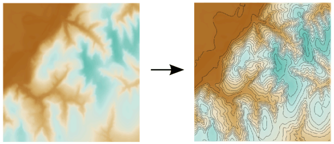
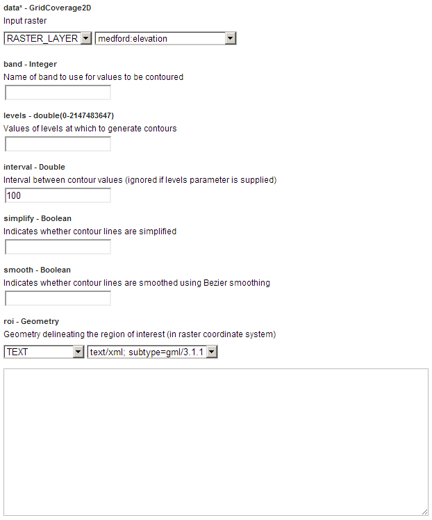
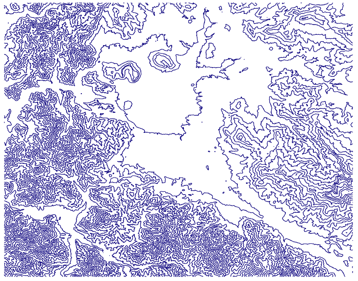
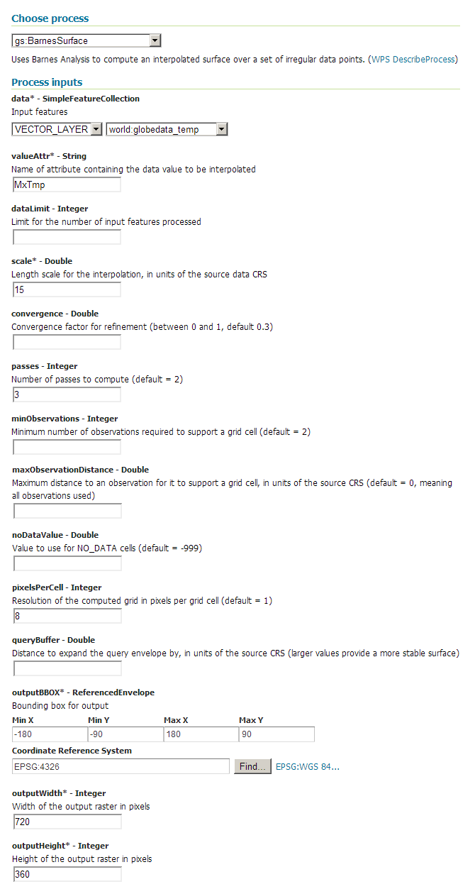
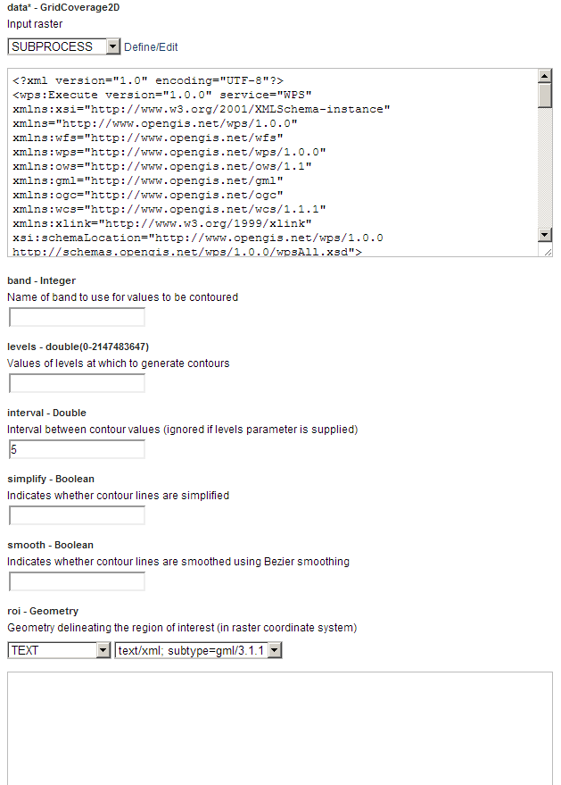
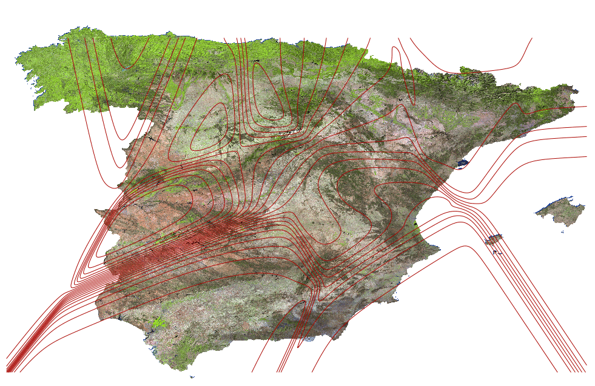

.. _processing.processes.raster.contour:

Contour
=======

.. warning:: Document status:: **Requires image revision, XML file, and questions answered (MP)**

Description
-----------

The ``gs:Contour`` process takes a grid coverage and creates a feature collection consisting of lines representing constant values. These are also known as *isolines*.

   *gs:Contour*

Inputs and outputs
------------------

This process accepts :ref:`processing.processes.formats.rasterin` and returns :ref:`processing.processes.formats.fcout`.

Inputs
~~~~~~

.. list-table::
   :header-rows: 1

   * - Name
     - Description
     - Type
     - Usage
   * - ``data``
     - Input grid coverage
     - :ref:`GridCoverage2D <processing.processes.formats.rasterin>`
     - Required
   * - ``band``
     - Band to use for values to be contoured. If not specified, the first band of the coverage will be used.
     - Integer
     - Optional
   * - ``levels``
     - Values at which to calculate contour lines
     - Double
     - Optional
   * - ``interval``
     - Interval between contour lines
     - Double
     - Optional
   * - ``simplify``
     - Indicates whether contour lines are simplified
     - Boolean
     - Optional
   * - ``smooth``
     - Indicates whether contour lines are smoothed using Bezier smoothing
     - Boolean
     - Optional
   * - ``roi``
     - Geometry delineating the region of interest (in raster coordinate system)
     - Geometry
     - Optional
   

Outputs
~~~~~~~

.. list-table::
   :header-rows: 1

   * - Name
     - Description
     - Type
   * - ``result``
     - Output feature collection
     - :ref:`SimpleFeatureCollection <processing.processes.formats.fcout>`

Usage notes
-----------

* The contour level is stored in the ``value`` attribute of the resulting feature collection.
* The resulting feature collection has the same CRS as the input grid coverage.
* If the input coverage has a low resolution, contour lines may have a jagged appearance. The ``smooth`` parameter can be set to ``true`` to mitigate this. Be aware that this is just a cosmetic modification, and does not create more precise contour lines.

Examples
--------

Creating elevation contour lines
~~~~~~~~~~~~~~~~~~~~~~~~~~~~~~~~

.. todo:: New ``medford:elevation`` or old ``medford:elevation``?

The ``medford:elevation`` layer contains elevation data. The following example uses this layer to create elevation contour lines with an interval of 100 meters.

Input parameters:

* ``data``: ``medford:elevation``
* ``band``: [Blank]
* ``levels``: [Blank]
* ``interval``: 100
* ``simplify``: False
* ``smooth``: False
* ``roi``: [Blank]

:download:`Download complete XML request <xml/contour.xml>`.

   *gs:Contour example parameters*

The resulting feature collection looks like this:

   *gs:Contour example output*

Creating temperature contour lines
~~~~~~~~~~~~~~~~~~~~~~~~~~~~~~~~~~

The following example chains the ``gs:Contour`` process with the :ref:`gs:BarnesSurface <processing.processes.vector.barnessurface>` process to extract contour lines from a points feature collection. The ``gs:BarnesSurface`` process computes an intermediate raster layer that is then converted back to contour lines by the ``gs:Contour`` process.

Contour lines are computed for an interval of 2 degrees, and the computation is limited to the area around the Iberian Peninsula.

.. note:: The detail of contour lines is directly affected by the interpolation process, since that defines the resolution of the intermediate coverage from which contour lines are calculated.

Input parameters for ``gs:BarnesSurface``:

* ``data``: ``world_globedata_temp``
* ``valueAttr``: MxTmp
* ``dataLimit``: [Blank]
* ``scale``: 1
* ``convergence``: [Blank]
* ``passes``: 3
* ``minObservations``: [Blank]
* ``maxObservationDistance``: [Blank]
* ``noDataValue``: [Blank]
* ``pixelsPerCell``: [Blank]
* ``queryBuffer``: [Blank]
* ``outputBBOX``: 

  * ``minX``: -9.5
  * ``minY``: 36
  * ``maxX``: 3.5
  * ``maxY``: 43.5
  * ``CRS``: ``EPSG:4326`` 

* ``outputWidth``: 780
* ``outputHeight``: 450

Input parameters for ``gs:Contour``.

* ``data``: Output from ``gs:BarnesSurface``
* ``band``: [Blank]
* ``levels``: [blank]
* ``interval``: 5
* ``simplify``: False
* ``smooth``: False
* ``roi``: [Blank]

:download:`Download complete chained XML request <xml/contour2.xml>`.

   *gs:Contour example parameters (part 1)*

   *gs:Contour example parameters (part 2)*

The output of the chained process looks like this:

   *gs:Contour example output*

Related processes
-----------------

* Other processes are available for converting a grid coverage into a feature collection. The :ref:`gs:PolygonExtraction <processing.processes.raster.polygonextraction>` process extracts polygons from a grid coverage, while the :ref:`gs:RasterAsPointCollection <processing.processes.raster.rasteraspoints>` process creates a points feature collection.

* The line simplification obtained by the ``simplify`` parameter can be similarly obtained by applying the :ref:`gs:Simplify <processing.processes.vector.simplify>` process the output of the ``gs:Contour`` process.

