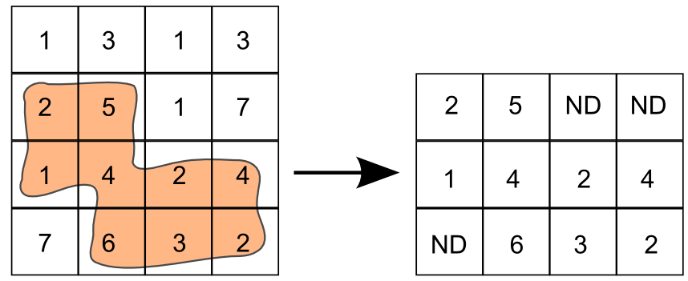
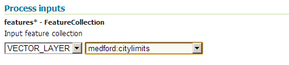
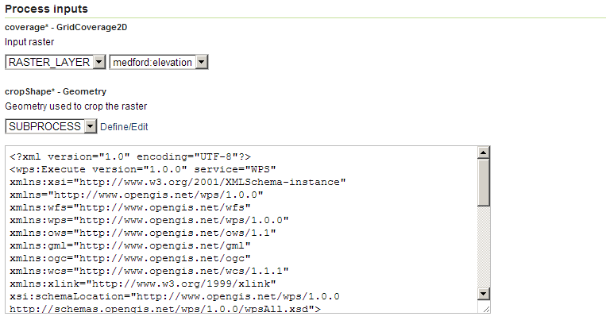
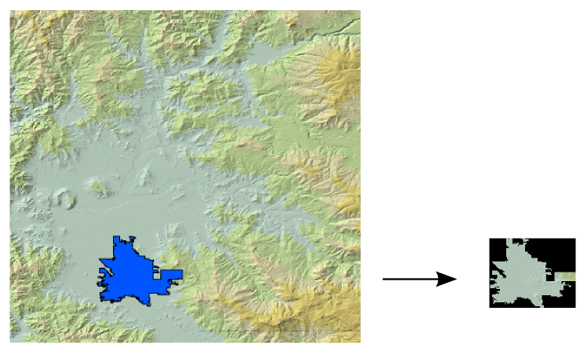

.. _processing.processes.raster.cropcoverage:

.. warning:: Document Status: Requires technical review

CropCoverage
==================

Description
-----------

The ``gs:CropCoverage`` process crops a grid coverage using a polygon geometry. The resulting output coverage contains the values from the input coverage, but just on those cells that fall within any of the polygons of the input feature collection. The remaining cells within the extent of the output coverage will have the corresponding :term:`no-data value`.

All cells outside the bounding box of the input geometry are not added to the resulting coverage, so the extent will not match the extent of the input coverage if the bounding box geometry is contained within its extent. 

The image below shows a descriptive example of how the ``gs:CropCoverage`` process works.

   *gs:Cropcoverage*

Inputs and outputs
------------------

This process accepts :ref:`processing.processes.formats.geomin` and :ref:`processing.processes.formats.rasterin`, and returns :ref:`processing.processes.formats.rasterout` 

Inputs
^^^^^^

.. list-table::
   :header-rows: 1

   * - Name
     - Description
     - Type
     - Required
   * - ``coverage``
     - The coverage to crop
     - :ref:`GridCoverage2D <processing.processes.formats.rasterin>`
     - Yes     
   * - ``cropShape``
     - The geometry to use for cropping
     - :ref:`Geometry <processing.processes.formats.geomin>`
     - Yes

Outputs
^^^^^^^

.. list-table::
   :header-rows: 1

   * - Name
     - Description
     - Type
   * - ``result``
     - The cropped coverage
     - :ref:`GridCoverage2D <processing.processes.formats.rasterout>`

Usage notes
--------------

* This process can be used with geometries of all types, although its most common usage is with polygon ones.

Examples
----------

The following example shows how to crop the ``medford:elevation`` coverage with the ``medford:citylimits`` feature collection. The ``gs:CollectGeometries`` process is used to get a geometry from the feature collection.

Input parameters for ``gs:CollectGeometries``:

* ``features``: ``medford:citylimits``

Input parameters for ``gs:CropCoverage``.

* ``coverage``: ``medford:elevation``
* ``cropShape``: Output from ``gs:CollectGeometries``

:download:`Download complete chained XML query <xml/cropcoverageexample.xml>`.

   *gs:CropCoverage example parameters (part 1)*

   *gs:CropCoverage example parameters (part 2)*

   *gs:CropCoverage example output*

Related processes
---------------------------------

* To crop a coverage using a feature collection instead of a geometry, use the `gs:CollectGeometries <processing.processes.vector.collectgeom>` to create a ``GeometryCollection`` object from the  feature collection, and then use it as input to this process, as shown in the example above.
* Use this process whenever you want to restrict the calculation performed by another process to the area covered by a geometry. No-data values are ignored by most raster processes, so they will perform their operations just on the cells with valid data values. If using a coverage cropped using the ``gs:CropCoverage`` process, those valid values will be just the ones within the geometry used to crop.

