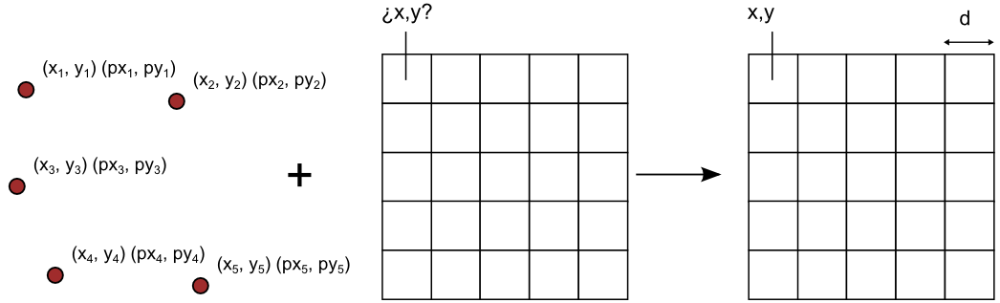

.. _processing.processes.raster.georectifycoverage:

.. warning:: Document Status: **Requires additional technical review and example (MP)**

GeorectifyCoverage
=======================

Description
-----------

The ``gs:GeorectofyCoverage`` process takes a grid coverage without geoeference information and a set of Ground-Control Points (GCPs), and creates a new grid coverage with georeference based on those GCPs.  This process is knows as *georectification*

   *gs:GeorectifyCoverage*

A GCP is comprised of a pair of point coordinates, one containing the grid coordinates (row, column), and the other one containing the world coordinates of the corrsponding point location. A set of GCPs allows to compute a mathematical relationship between grid and world coordinates, thus allowing to georectify the full grid coverage.

The process calls the external application ``gdal_warp``, who performs the actual process.

Inputs and outputs
------------------

This process accepts :ref:`processing.processes.formats.rasterin` and returns :ref:`processing.processes.formats.fcout`.

Inputs
~~~~~~

.. list-table::
   :header-rows: 1

   * - Name
     - Description
     - Type
     - Usage
   * - ``data``
     - Input feature collection
     - :ref:`GridCoverage2D <processing.processes.formats.rasterin>`
     - Required
   * - ``gcp``
     - List of Ground Control Points
     - String
     - Required
   * - ``bbox``
     - Bounding box of the output grid coverage
     - Envelope
     - Optional
   * - ``targetCRS``
     - CRS to use for the output coverage
     - CoordinateReferenceSystem
     - Required
   * - ``width``
     - Width of the resulting grid coverage, in cells
     - Integer
     - Optional
   * - ``height``
     - Height of the resulting grid coverage, in cells
     - Integer
     - Optional
   * - ``warpOrder``
     - Order of the warping polynomial (1 to 3)
     - Integer
     - Required  
   * - ``transparent``
     - Force output to have transparent background
     - Boolean
     - Required  
   * - ``store``
     - Indicates whether to keep the output file after processing
     - Boolean
     - Required  
   * - ``pathName``
     - Pathname where the output file is stored
     - String
     - Required       

Outputs
~~~~~~~

.. list-table::
   :header-rows: 1

   * - Name
     - Description
     - Type
   * - ``result``
     - The georectified output grid coverage.
     - :ref:`GridCoverage2D <processing.processes.formats.rasterout>`
   * - ``result``
     - The pathname of the generated raster in the server.
     - String 

Usage notes
-----------

* Points are entered as a string of space-separated values in the form of [x, y] of [x, y, z]. Notice the blank space after the comma.
* Each GCP is formed by two points. The first one is asummed to contain the grid coordinates, and the second one the world coordinates
* The output layer is produced in the CRS of the selected ``targetCRS``. Coordinates of GCPs are assumed to use that CRS.
* If the ``bbox`` parameter is used, the output layer will be clipped to its extent.
* Coordinates of this clipping bounding box are also assumed to be in the selected ``targetCRS``
* ``width`` and ``height`` parameter must be provided together. If only one of them is used, it will be ignored.
* If ``width`` and ``height`` parameters are used, the resulting georectified coverage will be resampled to adapt to those values.

Examples
--------

