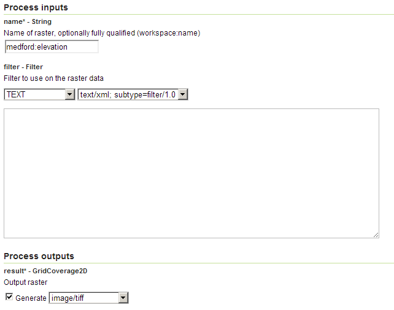

.. _processing.processes.raster.getfullcoverage:

GetFullCoverage
===============

Description
-----------

The ``gs:GetFullCoverage`` process returns a raster layer from the catalog, with optional filtering.

Inputs and outputs
------------------

``gs:BufferFeatureCollection`` accepts :ref:`processing.processes.formats.geomin` and returns :ref:`processing.processes.formats.fcout`.

Inputs
~~~~~~

.. list-table::
   :header-rows: 1

   * - Name
     - Description
     - Type
     - Usage
   * - ``name``
     - Name of the layer to return
     - String
     - Required
   * - ``filter``
     - Filter to use on the raster data
     - Filter
     - Optional

Outputs
~~~~~~~

.. list-table::
   :header-rows: 1

   * - Name
     - Description
     - Type
   * - ``result``
     - Output grid coverage
     - :ref:`GridCoverage2D <processing.processes.formats.rasterout>`

Usage notes
-----------

* The name of the coverage to return can be fully qualified (it includes a workspace name) or not. If no workspace is used, it will use the default workspace.
* The main purpose of this process is to make it easy to get a grid coverage by name as a WCS service

Examples
--------

The following example gets the ``medford:elevation`` coverage.

Input parameters:

* ``name``: ``medford:firestations``
* ``filter``: [Blank]

:download:`Download complete XML request <xml/getfullcoverage.xml>`

   *gs:GetFullCoverage example parameters*

