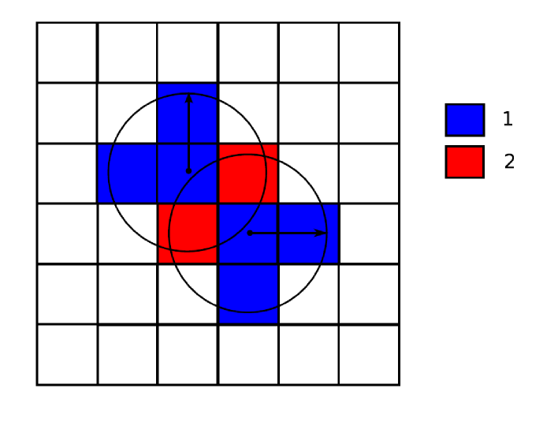
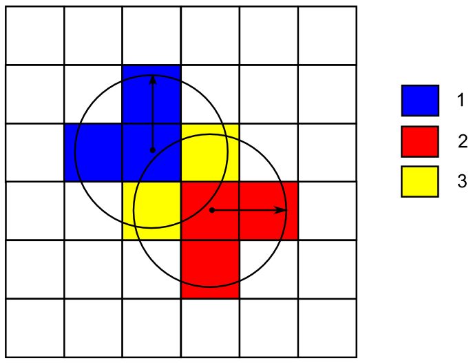
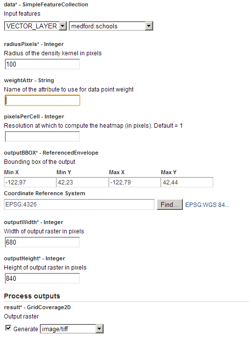
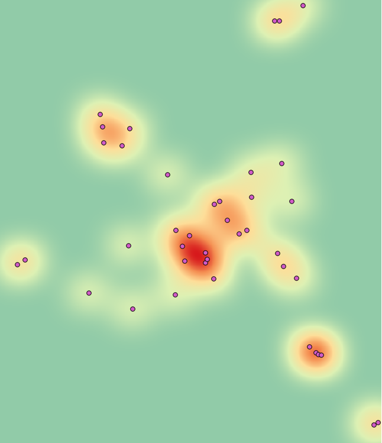
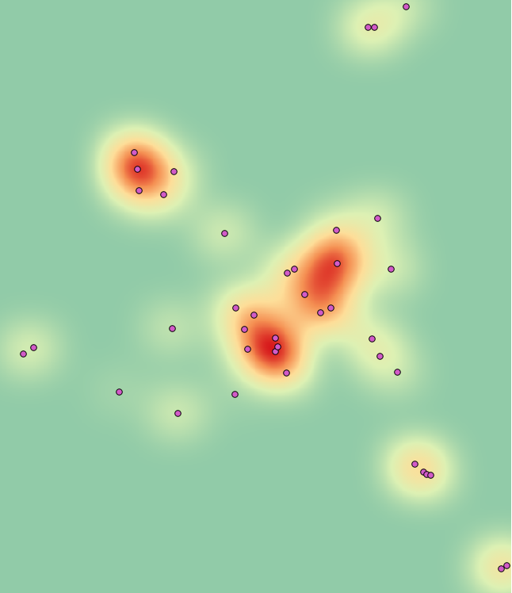

.. _processing.processes.raster.heatmap:

.. warning:: Document Status: **Requires additional technical review and example (MP)**

Heatmap
=======================

Description
-----------

The ``gs:Heatmap`` process takes a feature collection representing occurrences of a given spatial process and generates a raster layer representing the density of that process across a specified area.

Calculation is done by taking a given radius around each cell of the resulting grid coverage and adding up the values from features falling within that radius, as represented in the figure below 

   *gs:Heatmap*

The influence of a feature is modulated by its distance to the cell. Particularly, a `gaussian function<http://en.wikipedia.org/wiki/Gaussian_function>`_ is used to calculate the influence of a given feature occurrence at a given distance. The resulting coverage is normalized to have values within the (0,1) range.

Features can be weighted to indicate that the influence of a feature in the resulting density grid should be lower or higher. For instance, if the resulting grid coverage will be a population density coverage, and it is to be created from points representing cities, features should be weighted using the corresponding attribute which represents the population of each city.

  *gs:Heatmap*

Inputs and outputs
------------------

This process accepts :ref:`processing.processes.formats.rasterin` and returns :ref:`processing.processes.formats.fcout`.

Inputs
~~~~~~

.. list-table::
   :header-rows: 1

   * - Name
     - Description
     - Type
     - Usage
   * - ``data``
     - Input feature collection
     - :ref:`SimpleFeatureCollection <processing.processes.formats.fcin>`
     - Required
   * - ``radiusPixels``
     - Radius of the density kernel in pixels
     - Integer
     - Required
   * - ``weightAttr``
     - Name of the attribute to use for data point weight
     - String
     - Optional
   * - ``pixelsPerCell``
     - Resolution at which to compute the heatmap (in pixels). Default = 1
     - Integer
     - Optional
   * - ``outputBBOX``
     - Bounding box of the output
     - ReferencedEnvelope
     - Required     
   * - ``outputWidth``
     - Width of output raster in pixels
     - Integer
     - Required
   * - ``outputHeight``
     - Width of output raster in pixels
     - Integer
     - Required     

Outputs
~~~~~~~

.. list-table::
   :header-rows: 1

   * - Name
     - Description
     - Type
   * - ``result``
     - The output heatmap.
     - :ref:`GridCoverage2D <processing.processes.formats.rasterout>`

Usage notes
-----------

* Values in the attribute used as weight must resolve to a numeric value. If they do not resolve to a numeric value, the specified attribute does not exist or no attribute name is specified, the feature will have a weight of 1.
* The values of the weighting attribute do not affect the range of values in the output grid coverage, as this is always normalized to 1. Values in the output coverage do not have the same units as the values in the weighting attribute. Instead, the result coverage represent the probability distribution of the process represented by the input feature collection.
* This process accepts input feature collections with of all types of geometries. For non-point geometries, the centroid of the geometry is used as its representing point.
* The output layer is produced in the CS of the selected ``ReferenceEnvelope``. Input features can have a different CRS, and they will be reprojected if needed.

Examples
--------

Calculating a heatmap of schools
~~~~~~~~~~~~~~~~~~~~~~~~~~~~~~~~~~~~~~~~~~

The following example converts the ``medford:elevation`` grid coverage into a points feature collection with elevation values. Each point has one associated attribute corresponding to the only value in the input grid, which corresponds to the elevation of the cell.

Input parameters:

* ``data``: ``medford:schools``
* ``radiusPixels``: 50
* ``weightAttr``: [Blank]
* ``pixelsPerCell``: 1
* ``outputBBOX``: 

  * ``minX``: -122.97
  * ``minY``: 42.23
  * ``maxX``: -122.80
  * ``maxY``: 42.44
  * ``CRS``: ``EPSG:4326`` 

* ``outputWidth``: 170
* ``outputHeight``: 210

:download:`Download complete XML request <xml/heatmap.xml>`

   *gs:Heatmap example parameters*

   *gs:Heatmap example result*

The above result represents the density of school buildings. To compute a density map of school places, the input feature collection can be weighted using the ``students`` attribute, as in the example below.

Input parameters:

* ``data``: ``medford:schools``
* ``radiusPixels``: 50
* ``weightAttr``: ``students``
* ``pixelsPerCell``: 1
* ``outputBBOX``: 

  * ``minX``: -122.97
  * ``minY``: 42.23
  * ``maxX``: -122.80
  * ``maxY``: 42.44
  * ``CRS``: ``EPSG:4326`` 

* ``outputWidth``: 680
* ``outputHeight``: 840

:download:`Download complete XML request <xml/heatmap2.xml>`

.. figure:: img/heatmapUI2.png

   *gs:Heatmap example parameters*

   *gs:Heatmap example result*

Related processes
-----------------

* Since this process requires an input of type ``ReferenceEnvelope`` to set the area covered by the output grid coverage, the ``gs:Bounds`` process can be used to extract the required extent from a given feature collection. Particularly, it is of interest to extract the envelope of the same layer used as input for the ``gs:Heatmap`` process so the extent of the output coverage is that of the input feature collection.

