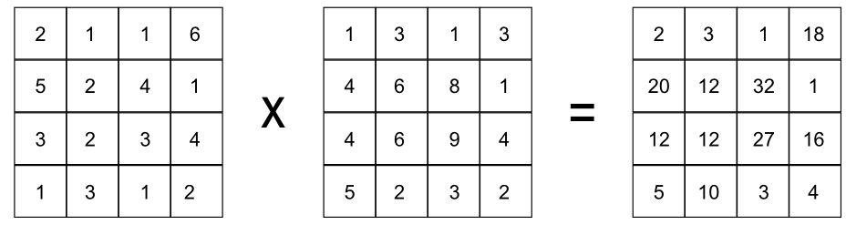
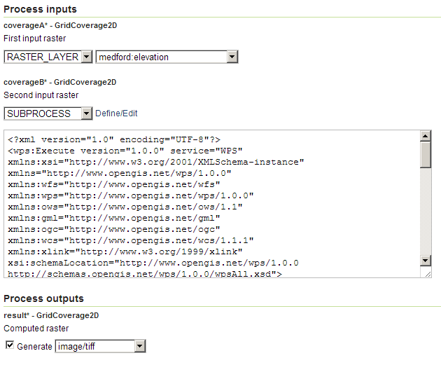
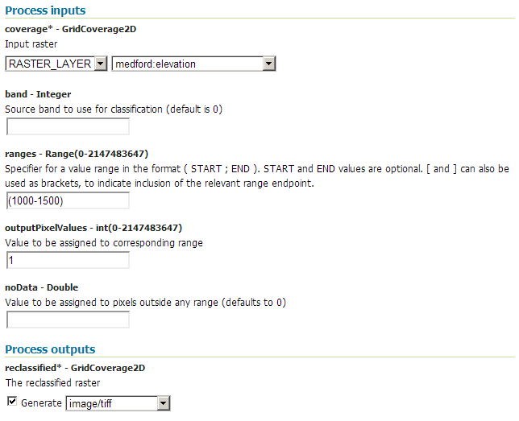
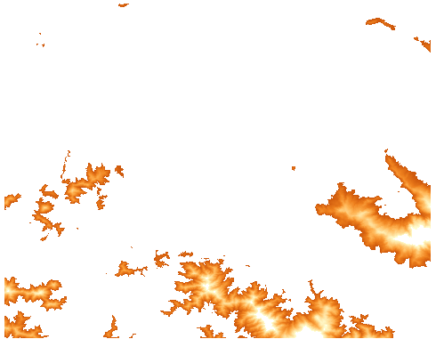

.. _processing.processes.raster.multiplycoverages:

.. warning:: Document Status: **Requires questions answered (MP)**

MultiplyCoverages
=================

Description
-----------

The ``gs:MultiplyCoverages`` process takes two input grid coverages with a single band and performs a cell-by-cell multiplication on them, generating a new grid coverage. Each cell in the output grid has the value resulting from the multiplication of the corresponding values for that same cell in the input grids.

.. todo:: What happens if you input a multiband raster?

   *gs:MultiplyCoverages*

Inputs and outputs
------------------

This process accepts :ref:`processing.processes.formats.rasterin` and returns :ref:`processing.processes.formats.rasterout`.

Inputs
~~~~~~

.. list-table::
   :header-rows: 1

   * - Name
     - Description
     - Type
     - Usage
   * - ``coverageA``
     - First input coverage
     - :ref:`GridCoverage2D <processing.processes.formats.rasterin>`
     - Required
   * - ``coverageB``
     - Second input coverage
     - :ref:`GridCoverage2D <processing.processes.formats.rasterin>`
     - Required    

Outputs
~~~~~~~

.. list-table::
   :header-rows: 1

   * - Name
     - Description
     - Type
   * - ``result``
     - Output coverage
     - :ref:`GridCoverage2D <processing.processes.formats.rasterout>`

Usage notes
-----------

* Both input coverages must have the same bounding box and the same cell size. That means they must have the same width and height (in cells), so that their cell locations match exactly.
* The output coverage will have the same bounding box and cell size as the input.
* Both input grids must have only one band.
* This process can be used to "mask" certain cells in a given raster by using a mask grid with zero or ``NODATA`` values in those cells to be masked out. This is useful as a data-preparation technique when it is desired to restrict data to a certain area.

.. todo::

   The original note here seems a bit abstruse. Is this a common use case? I'd like more details here, or convert this into an example.

   "* Given two probability raster with values in the (0,1) range (such as those produced by the ``gs:Heatmap`` process), applying this process to them represents the equivalent of a fuzzy logic AND operation."

Examples
--------

Masking areas outside of an elevation range
~~~~~~~~~~~~~~~~~~~~~~~~~~~~~~~~~~~~~~~~~~~

The following example masks all elevation areas outside of a certain elevation range, by multiplying the ``medford:elevation`` layer by a mask grid created using the :ref:`gs:RangeLookup <processing.processes.raster.rangelookup>` process and that same layer. This will allow for further calculation with values restricted to those cells within the elevation range.

Input parameters for ``gs:RangeLookup``

* ``data``: ``medford:elevation``
* ``band``: [Blank]
* ``ranges``: (1000;1500)
* ``noData``: [Blank]
* ``outputPixelValues``: 1

Input parameters for ``gs:MultiplyCoverages``

* ``coverageA``: ``medford:elevation``
* ``coverageA``: result of ``gs:RangeLookup``

:download:`Download complete chained XML request <xml/multiplycoverages.xml>`.

   *gs:MultiplyCoverages example parameters (part 1)*

.. todo:: Range parameter is (1000-1500) in this graphic, but (1000;1500) in the above. Is the graphic wrong?

   *gs:MultiplyCoverages example parameters (part 2)*   

   *gs:MultiplyCoverages example output*

Related processes
-----------------

* The :ref:`gs:AddCoverages <processing.processes.raster.addcoverages>` process performs a similar operation, adding cell values instead of multiplying them.
* The masking process mentioned above can be performed using a polygon feature collection instead of a grid coverage using the :ref:`gs:CropCoverage <processing.processes.raster.cropcoverage>` process.

