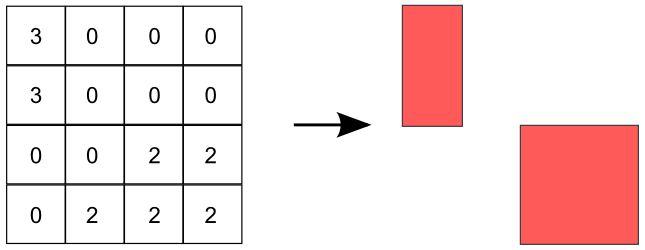
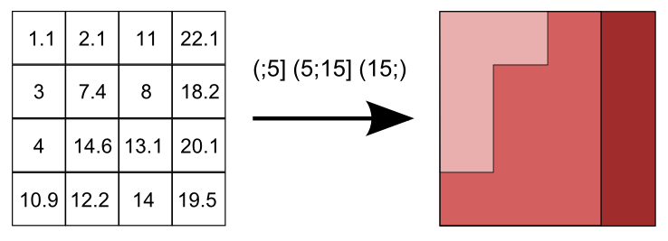

.. _processing.processes.vectortoraster:

.. warning:: Document Status: Draft

PolygonExtraction
======================

Description
-----------

The ``gs:`PolygonExtraction`` process creates a polygon feature collection from a grid coverage. Polygons represent areas in the input coverage which contain the same values. Polygons are traced using the cell boundaries.

   *gs:PolygonExtraction*

This approach is valid if the layer contains areas of several contiguous cells with the same value. In case of using a layer such as a DEM, in which is unlikely to find neighbor pixels with exactly the same value, it will result in an output feature collection containing a very large number of polygons of the size of a single cell. 

In this case, the ``gs:PolygonExtraction`` process can perform a previous reclassification to group cells within a set of ranges, so they are considered as belonging to the same class, and are, thus, part of the same resulting polygon.

   *gs:PolygonExtraction using predefined ranges*

Certain values can be left outside of the polygon extraction process, defining them as no-data values. Cells with those values will be ignored and no polygon will be created from them.

Also, certain areas can be left outside of the polygon extraction process by defining a Region Of Interest (ROI) using a geometry. If so, analysis will be limited to those cells within the ROI.

The output feature collection has an attribute named *the_geom* with the extracted polygon, and another one of type ``Double`` named *value*, which contains the value associated to that polygon (the common value of the cells inside of the polygon in the input grid coverage).

Inputs and outputs
------------------

This process accepts :ref:`processing.processes.formats.rasterin` and returns :ref:`processing.processes.formats.fcout`.

Inputs
^^^^^^

.. list-table::
   :header-rows: 1

   * - Name
     - Description
     - Type
     - Required
   * - ``data``
     - Grid coverage from which to extract polygons
     - :ref:`GridCoverage2D <processing.processes.formats.rasterin>`
     - Yes
   * - ``band``
     - The band from which to take values. This index is zero-based. Defaults to zero (that is, to the first band)
     - Integer
     - No 
   * - ``insideEdges``
     - Indicates whether to vectorize boundaries comprised of no-data values between adjacent regions with valid values.
     - Boolean
     - No
   * - ``roi``
     - The region of interest to analyze. If used, only cells within this region are considered
     - Geometry
     - No
   * - ``nodata``
     - The values to consider as no-data values.
     - Integer
     - Yes   
   * - ``ranges``
     - The ranges to use to reclassify the input coverage before extracting polygons
     - list
     - No         

Outputs
^^^^^^^

.. list-table::
   :header-rows: 1

   * - Name
     - Description
     - Type
   * - ``result``
     - The output coverage, with the rasterized version of the input feature collection.
     - :ref:`GridCoverage2D <processing.processes.formats.rasterout>`

Usage notes
--------------

- No-data value to ignore are entered as a string of comma-separated values. For instance, ``"0, -1, 2.2"``
- Ranges are entered as a string containing space-separated ranges. Each range is defined as a string in the form ``(START ; END)``. If ``START`` os missing, there is no lower limit in the range. If ``END`` is missing, there is no upper limit. Instead of common brackets, square brackets ``[]`` can be used to indicate that the ``START`` and/or ``END`` value belong to the range. For instance to create to ranges, one with all the value lower or equal to 1000, and another one with all values above 1000, the following string can be used: ``(;1000] (1000;)``
- If the ``ranges`` parameter is used, the value of the ``nodata`` parameter is ignored. All values not belonging to any of the defined ranges are considered no-data values.
- If the ``ranges`` parameter is used, the ``value`` attribute in the ouput feature collection contains the zero-based index of the range, not the original value of the cells in the grid coverage.
- Non-adjacent regions with the same value will yield several different features, in spite of their common value.

Examples
---------

.. todo::

Related processes
-------------------

- This process is of interest for all those processes that take polygon feature collections as input, when the data to supply to those processes is available as a grid coverage.

- This process is the inverse of the `gs:VectorToRaster <processing.processes.raster.vectortoraster>` process, which creates a grid coverage from a feature collection.

- Other processes are available to convert from a grid coverage into a feature collection. To create a points feature collection, use the `gs:RasterAsPointCollection <processing.processes.raster.rasteraspoints>` process. To create a lines feature collection with contour lines from a grid coverage, use the `gs:Contour <processing.processes.raster.contour>` process.

