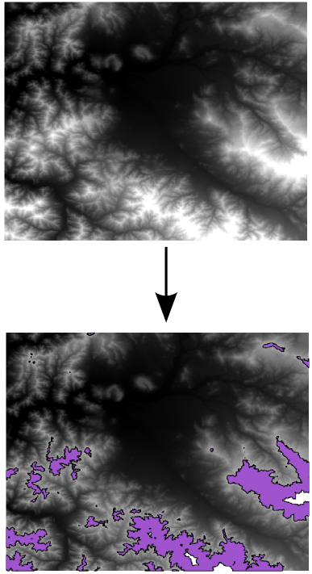

.. _processing.processes.raster.polygonextraction:

.. warning:: Document Status: **Requires images edited and questions answered (MP)**

PolygonExtraction
=================

Description
-----------

The ``gs:PolygonExtraction`` process takes an input raster and creates a polygon feature collection. Polygons represent areas in the input coverage that contain equal values. Polygons are traced using the cell boundaries. This process is useful if the layer contains areas of several contiguous cells with the same value.

.. figure:: img/polygonextraction.png

   *gs:PolygonExtraction*

The process can also perform a reclassification to group cells within a set of ranges so they are considered as belonging to the same class, which is useful when working with grid coverages such as a DEM (digital elevation model) or other raster with a continuous (non-discrete) variable, where neighbor pixels usually don't share the same values.

.. figure:: img/polygonextraction2.png

   *gs:PolygonExtraction using predefined ranges*

Certain values can be left outside of the polygon extraction process, defining them as ``NODATA`` values. Cells with those values will be ignored and no polygon will be created from them.

Also, certain areas can be left outside of the polygon extraction process by defining a "region of interest" using a geometry. If so, analysis will be limited to those cells within that region.

The output feature collection has an attribute named ``the_geom`` with the extracted polygon, and another one named ``value``, which contains the grid value associated with that polygon.

Inputs and outputs
------------------

This process accepts :ref:`processing.processes.formats.rasterin` and returns :ref:`processing.processes.formats.fcout`.

Inputs
~~~~~~

.. list-table::
   :header-rows: 1

   * - Name
     - Description
     - Type
     - Usage
   * - ``data``
     - Grid coverage from which to extract polygons
     - :ref:`GridCoverage2D <processing.processes.formats.rasterin>`
     - Required
   * - ``band``
     - Band from which to take values. This index is zero-based. Default is zero (first band).
     - Integer
     - Optional
   * - ``insideEdges``
     - Indicates whether to vectorize boundaries comprised of no-data values between adjacent regions with valid values
     - Boolean
     - Optional
   * - ``roi``
     - Region of interest to analyze. If used, only cells within this region are considered.
     - :ref:`Geometry <processing.processes.formats.geomin>`
     - Optional
   * - ``nodata``
     - Values to classify as ``NODATA``
     - Integer
     - Optional  
   * - ``ranges``
     - The ranges to use to reclassify the input coverage before extracting polygons
     - list
     - Required         

Outputs
~~~~~~~

.. list-table::
   :header-rows: 1

   * - Name
     - Description
     - Type
   * - ``result``
     - Output feature collection
     - :ref:`SimpleFeatureCollection <processing.processes.formats.fcout>`

Usage notes
-----------

* The ``nodata`` parameter is entered as a string of comma-separated values. For instance: ``0, -1, 2.2``.
* If the ``ranges`` parameter is used, the value of the ``nodata`` parameter is ignored. All values not belonging to any of the defined ranges will be considered no-data values.
* If the ``ranges`` parameter is used, the ``value`` attribute in the output feature collection will contain the (zero-based) index of the range, not the original value of the cells in the grid coverage.
* Non-adjacent regions with the same value will yield different features.

.. todo::

   This second bullet point given in the above usage notes needs to be reviewed for accuracy and verified.

   * The ``ranges`` parameter is entered as a string containing space-separated ranges. Each range is defined as a string in the form ``(START;END)``. If ``START`` is omitted, there is no lower limit in the range. If ``END`` is omitted, there is no upper limit. Instead of common brackets, square brackets ``[]`` can be used to indicate that the ``START`` or ``END`` value belong to the range.
     * To create ranges every 50 units from 0 to 200, the following string would be used: ``[0;50] [50;100] [100;150] [150;200]``
     * To create two ranges, one with all the values less than or equal to 1000, and another one with all values greater than 1000, the following string would be used: ``(;1000] (1000;)``

Examples
--------

Creating a polygon from an elevation range
~~~~~~~~~~~~~~~~~~~~~~~~~~~~~~~~~~~~~~~~~~

This example creates a polygon feature collection corresponding to all areas in the ``meford:elevation`` grid coverage with an elevation between 1000 and 1500 meters.

Input parameters:

* ``data``: ``medford:elevation``
* ``band``: [Blank]
* ``insideEdges``: [Blank]
* ``roi``: [Blank]
* ``noData``: [Blank]
* ``ranges``: (1000;1500)

:download:`Download complete XML request <xml/polygonextraction.xml>`.

.. figure:: img/polygonextractionUI.png

   *gs:PolygonExtraction example parameters*

   *gs:PolygonExtraction example output*

Related processes
-----------------

* If working with polygons, this process is the inverse of the :ref:`gs:VectorToRaster <processing.processes.vector.vectortoraster>` process, which creates a grid coverage from a feature collection.
* Other processes are available to convert from a grid coverage into a feature collection. To create a points feature collection, use the :ref:`gs:RasterAsPointCollection <processing.processes.raster.rasteraspoints>` process. To create a lines feature collection with contour lines from a coverage, use the :ref:`gs:Contour <processing.processes.raster.contour>` process.

