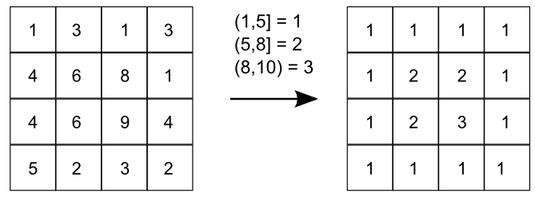
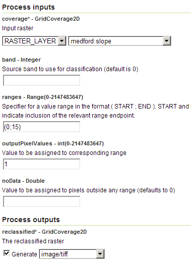
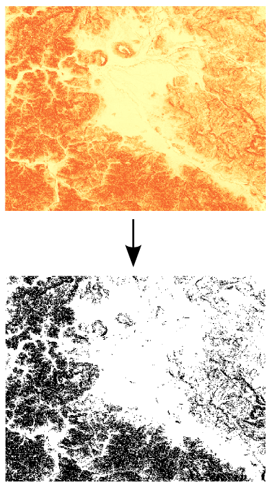

.. _processing.processes.raster.rangelookup:

.. warning:: Document Status: **Requires questions answered (MP)**

RangeLookup
===========

Description
-----------

The ``gs:RangeLookup`` process takes an input coverage and reclassifies its values according to a set of defined ranges. For each range, a new value is defined, and all cells with values within the range will have that corresponding new value in the output coverage.

   *gs:RangeLookup*

.. todo:: The above graphic has commas instead of semi-colons, with doesn't match the text. Is this correct?

Inputs and outputs
------------------

This process accepts :ref:`processing.processes.formats.rasterin` and returns :ref:`processing.processes.formats.rasterout`.

Inputs
~~~~~~

.. list-table::
   :header-rows: 1

   * - Name
     - Description
     - Type
     - Usage
   * - ``coverage``
     - Input grid coverage to reclassify
     - :ref:`GridCoverage2D <processing.processes.formats.rasterin>`
     - Required
   * - ``band``
     - Band from which to take values. This index is zero-based. Default is 0 (first band).
     - Integer
     - Optional
   * - ``ranges``
     - List of ranges to use to reclassify the input coverage
     - List
     - Optional       
   * - ``outputPixelValues``
     - List of values to be assigned to the defined ranges
     - Boolean
     - No   
   * - ``noData``
     - Value to be assigned to pixels outside any range (default is 0)
     - Integer
     - Optional
       

Outputs
~~~~~~~

.. list-table::
   :header-rows: 1

   * - Name
     - Description
     - Type
   * - ``reclassified``
     - Output coverage with classifications
     - :ref:`GridCoverage2D <processing.processes.formats.rasterout>`

Usage notes
-----------

* The output coverage will have the same CRS and cell size as the input.
* The number of elements in the list representing ranges has to be the same as the number of elements in that representing the output values.
* If two ranges overlap, the first range will have priority in that range.
* The ``ranges`` parameter is entered as a string containing space-separated ranges. Each range is defined as a string in the form ``(START;END)``. If ``START`` is omitted, there is no lower limit in the range. If ``END`` is omitted, there is no upper limit. Square brackets ``[]`` indicate that the ``START`` or ``END`` value belong to the range, while parentheses ``()`` exclude the specific values of ``START`` and ``END``.

  * To create ranges every 50 units from 0 to 200 inclusive, the following string would be used: ``[0;50] [50;100] [100;150] [150;200]``
  * To create two ranges, one with all the values less than or equal to 1000, and another one with all values greater than 1000, the following string would be used: ``(;1000] (1000;)``

* The data type of the output is the smallest one that can hold the values used as new class values (those in the ``outputPixelvalues`` parameter). For instance, the ``byte`` data type takes 8 bits per value and can hold values in the [-128, 127] range. If a reclassified value of 300 is entered in the ``outputPixelValues``, the resulting grid cannot use the ``byte`` data type. It should use the ``short`` data type, which uses 16bits and can hold that value. Notice that this is not related to the number of classes defined in the ``outputPixelValues`` parameter, but rather to the magnitude of the values.

Examples
--------

Selecting suitable slope areas
~~~~~~~~~~~~~~~~~~~~~~~~~~~~~~

Assuming that a certain process occurs only in areas with a slope lower than 15%, this example finds all the areas in the ``medford:slope`` layer that are suitable for that process. The layer contains slope values in percentage, and the following example classifies them in two groups (suitable = 1, not suitable = 0) using the ``gs:RangeLookup`` process.

Input parameters:

* ``data``: ``medford:slope``
* ``band``: [Blank]
* ``ranges``: (0;15)
* ``noData``: [Blank]
* ``outputPixelValues``: 1

:download:`Download complete XML request <xml/rangelookup.xml>`.

   *gs:RangeLookup example parameters*

   *gs:RangeLookup example output*

Related processes
-----------------

* The :ref:`gs:PolygonExtraction <processing.processes.raster.polygonextraction>` performs a similar reclassification to create an intermediate grid from which polygons can be extracted.
