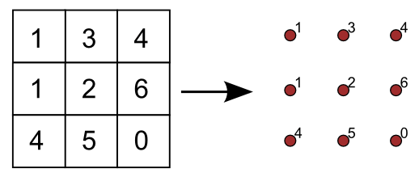
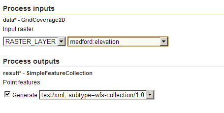

.. _processing.processes.raster.rasteraspoints:

.. warning:: Document Status: **Requires additional technical review and example (MP)**

RasterAsPointCollection
=======================

Description
-----------

The ``gs:RasterAsPointCollection`` process takes an input grid coverage and creates a points feature collection. The collection contains as many points as cells are in the input coverage, one corresponding to each of them.

   *gs:RasterAsPointsCollection*

Each point is located exactly in the center of the corresponding cell.

The attributes table of the output layer contains as many attributes as bands can be found in the input grid coverage, named with the same name as the corresponding band. Attributes are populated using the values for those bands in the input coverage.

Inputs and outputs
------------------

This process accepts :ref:`processing.processes.formats.rasterin` and returns :ref:`processing.processes.formats.fcout`.

Inputs
~~~~~~

.. list-table::
   :header-rows: 1

   * - Name
     - Description
     - Type
     - Usage
   * - ``data``
     - Grid coverage from which to extract points
     - :ref:`GridCoverage2D <processing.processes.formats.rasterin>`
     - Required
   * 

Outputs
~~~~~~~

.. list-table::
   :header-rows: 1

   * - Name
     - Description
     - Type
   * - ``result``
     - The output point feature collection.
     - :ref:`SimpleFeatureColelction <processing.processes.formats.fcout>`

Usage notes
-----------

* The output point feature collection has the same CRS as the input grid coverage
* If the input layer contains no-data values, those will appear in the resulting layer with its original value. The process does not make any distinction, and will not label those values as no-data or null by using a particular value, but will enter the actual value of the grid coverage instead.

Examples
--------

Convert elevation grid to elevation points
~~~~~~~~~~~~~~~~~~~~~~~~~~~~~~~~~~~~~~~~~~~~

The following example converts the ``medford:elevation`` grid coverage into a points feature collection with elevation values. Each point has one associated attribute coresponding to the only value in the input grid, which corresponds to the elevation of the cell.

Input parameters:

* ``data``: ``medford:elevation``

:download:`Download complete XML request <xml/rastertopoints.xml>`

   *gs:RasterAsPointCollection example parameters*

.. figure:: img/rastertopointsexample.png

   *Partial rendering of resulting points feature collection and input grid coverage*

Related processes
-----------------

* Other processes are available to convert a raster layer into a vector one (vectorization). To create a polygon feature collection with polygons covering cells with a given value or a range of values , use the :ref:`gs:PolygonExtraction <processing.processes.raster.polygonextraction>` process. To create a lines feature collection with contour lines from a grid coverage, use the :ref:`gs:Contour <processing.processes.raster.contour>` process.

