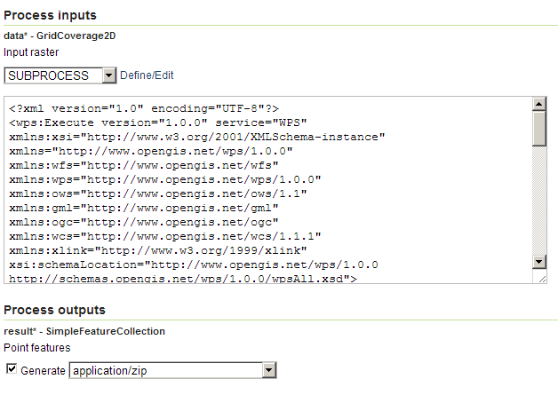
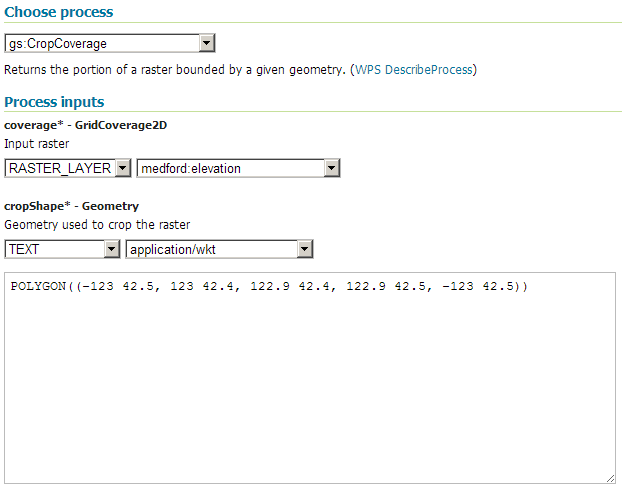
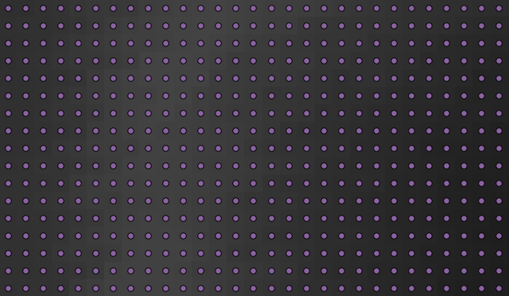

.. _processing.processes.raster.rasteraspoints:

.. warning:: Document Status: **Requires images edited and questions answered (MP)**

RasterAsPointCollection
=======================

Description
-----------

The ``gs:RasterAsPointCollection`` process takes an input grid coverage and creates a points feature collection. The collection contains as many points as cells are in the input coverage, each point corresponding to a cell. Each point is located exactly in the center of the cell.

.. figure:: img/rasteraspoints.png

   *gs:RasterAsPointsCollection*

The attributes table of the output feature collection contains as many attributes as bands in the input grid coverage, named with the same name as the corresponding band. Attributes are populated using the values for those bands in the input coverage.

Inputs and outputs
------------------

This process accepts :ref:`processing.processes.formats.rasterin` and returns :ref:`processing.processes.formats.fcout`.

Inputs
~~~~~~

.. list-table::
   :header-rows: 1

   * - Name
     - Description
     - Type
     - Usage
   * - ``data``
     - Grid coverage from which to extract points
     - :ref:`GridCoverage2D <processing.processes.formats.rasterin>`
     - Required   

Outputs
~~~~~~~

.. list-table::
   :header-rows: 1

   * - Name
     - Description
     - Type
   * - ``result``
     - Output point feature collection.
     - :ref:`SimpleFeatureCollection <processing.processes.formats.fcout>`

Usage notes
-----------

* The output point feature collection has the same CRS as the input grid coverage.
* If the input layer contains ``NODATA`` values, those will appear in the resulting layer with their original values. The process does not make any distinction, and will not label those values as null, but will enter the actual value of the grid coverage instead. Since a missing value is indicated in an feature collection with a null value, those points that have been created from a NODATA cell using this process will not be interpreted by other processes as points without a value, but rather as points with a valid value.

.. todo:: NODATA is NODATA is NODATA, right? What is this bullet point trying to say?

Examples
--------

Convert elevation grid to elevation points
~~~~~~~~~~~~~~~~~~~~~~~~~~~~~~~~~~~~~~~~~~

This example converts the ``medford:elevation`` layer into a points feature collection with elevation values. Each point has one associated attribute corresponding to the value of the original cell.

To avoid creating a layer with too many points, the input layer is initally cropped using the :ref:`gs:CropCoverage <processing.processes.raster.cropcoverage>` process.

Input parameters for ``gs:CropCoverage``:

* ``coverage``: ``medford:elevation``
* ``cropShape``: ``POLYGON((-123 42.5, 123 42.4, 122.9 42.4, 122.9 42.5, -123 42.5))``

Input parameters for ``gs:RasterAsPoints``:

* ``data``: Output from ``gs:CropCoverage``

:download:`Download complete chained XML request <xml/rasteraspoints.xml>`.

   *gs:RasterAsPointCollection example parameters (part 1)*

   *gs:RasterAsPointCollection example parameters (Part 2)*   

   *Partial rendering of resulting points feature collection and input grid coverage*

.. todo:: This graphic doesn't show much. Can the output be more diagrammatic (showing the values of the grid cells and then the values of the points)?

Related processes
-----------------

* Other processes are available to convert a raster layer into a vector layer. To create a polygon feature collection with polygons covering cells with a given value or a range of values, use the :ref:`gs:PolygonExtraction <processing.processes.raster.polygonextraction>` process. To create a lines feature collection with contour lines from a coverage, use the :ref:`gs:Contour <processing.processes.raster.contour>` process.

