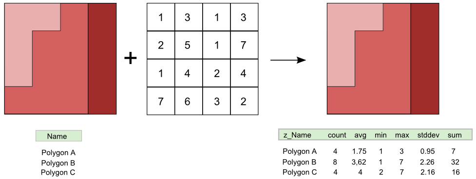
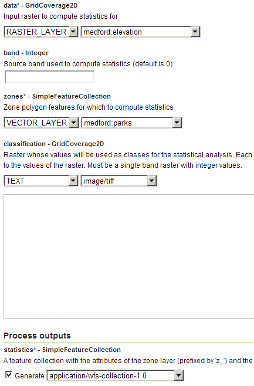

.. _processing.processes.raster.rasterzonalstats:

.. warning:: Document Status: **Requires images edited and questions answered (MP)**

RasterZonalStatistics
=====================

Description
-----------

The ``gs:RasterZonalStatistics`` process calculates statistics of a given raster layer within the polygons of a feature collection. The output feature collection contains all the attributes of the original feature collection, along with new attributes where statistics are stored. The following statistics are computed: **count**, **average**, **minimum value**, **maximum value**, **standard deviation**, and **sum**.

   *gs:RasterZonalStatistics*

An additional grid coverage with categories can be specified, in which case the statistics would be calculated considering both the polygons and the classes defined by this second grid coverage

Inputs and outputs
------------------

This process accepts :ref:`processing.processes.formats.rasterin` along with :ref:`processing.processes.formats.fcin`, and returns :ref:`processing.processes.formats.fcout`.

Inputs
~~~~~~

.. list-table::
   :header-rows: 1

   * - Name
     - Description
     - Type
     - Usage
   * - ``data``
     - Input grid coverage to reclassify
     - :ref:`GridCoverage2D <processing.processes.formats.rasterin>`
     - Required
   * - ``band``
     - Band from which to take values. This index is zero-based. Default is zero (first band).
     - Integer
     - Optional
   * - ``zones``
     - Zone polygon features for which to compute statistics
     - :ref:`SimpleFeaturesCollection<processing.processes.formats.fcin>`
     - Optional
   * - ``classification``
     - Raster whose values will be used as classes for the statistical analysis
     - :ref:`GridCoverage2D <processing.processes.formats.rasterin>`
     - Optional 

Outputs
~~~~~~~

.. list-table::
   :header-rows: 1

   * - Name
     - Description
     - Type
   * - ``statistics``
     - Output feature collection with statistics of the input grid coverage
     - :ref:`SimpleFeatureCollection <processing.processes.formats.fcout>`

Usage notes
-----------

.. todo::

   Please elaborate on this. Which layers are you talking about? Which one will be reprojected to the other?

   "* Input layers can have different CRS's, and they will be reprojected if needed."

* If used, the ``classification`` parameter must be a coverage with a single band consisting of integer values representing classes.
* The names of the attributes where the statistics are stored are: ``count``, ``min``, ``max``, ``sum``, ``avg``, and ``stddev``.
* Original attributes do not keep their exact original names, but are instead prefixed with the ``z_`` prefix.
* If a classification coverage is used, statistics are partitioned by classes according to the values in that coverage.
* If no cells are found within a given polygon to calculate of the parameters above, a ``NaN`` ("not a number") value will be assigned.

Examples
--------

Calculating elevation statistics for parks
~~~~~~~~~~~~~~~~~~~~~~~~~~~~~~~~~~~~~~~~~~

The following example calculates elevation statistics for the parks in the Medford area. To do so, it uses the ``medford:elevation`` coverage and the ``medford:parks`` feature collection.

Input parameters:

* ``data``: ``medford:elevation``
* ``band``: [Blank]
* ``zones``: ``medford:parks``
* ``classification``: [Blank]

:download:`Download complete XML request <xml/rasterzonalstats.xml>`.

   *gs:RasterZonalStatistics example parameters*

.. todo:: Result image?

Related processes
-----------------

* The :ref:`gs:VectorZonalStats <processing.processes.vector.vectorzonalstats>` performs a similar analysis, but uses as input a points layer instead of a raster layer and calculates statistics of those points that fall within each polygon.

