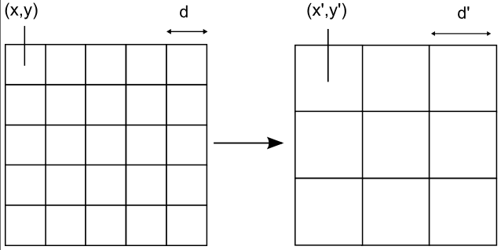
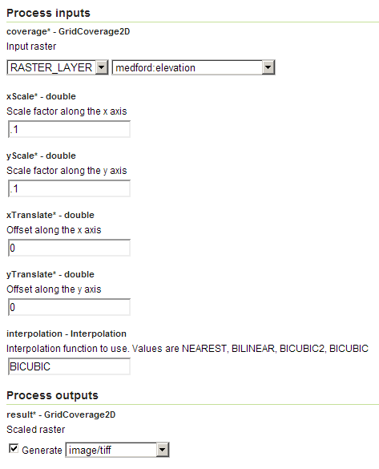
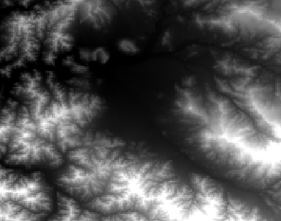

.. _processing.processes.raster.scalecoverage:

.. warning:: Document Status: **Requires images edited and questions answered (MP)**

.. todo::

   (VO) The name of this process is really confusing. It does not perform an scaling, but a resampling. It should be changed 
   (MP) No specific argument here, but create a ticket for it! When it's renamed, we'll change it here.

ScaleCoverage
=============

Description
-----------

The ``gs:ScaleCoverage`` process transforms a raster layer, altering the cell size and/or translating it. Both operations can be applied independently for both the *x* and *y* axis.

   *gs:ScaleCoverage*

The scale parameters define a resampling of the original grid coverage. The resulting grid will have the same extent, but the cell size is modified.

Inputs and outputs
------------------

This process accepts :ref:`processing.processes.formats.rasterin` and returns :ref:`processing.processes.formats.rasterout`.

Inputs
~~~~~~

.. list-table::
   :header-rows: 1

   * - Name
     - Description
     - Type
     - Usage
   * - ``coverage``
     - Input grid coverage to scale
     - :ref:`GridCoverage2D<processing.processes.formats.rasterin>`
     - Required
   * - ``xScale``
     - Scale factor along the *x* axis
     - Double
     - Required
   * - ``yScale``
     - Scale factor along the *y* axis
     - Double
     - Required
   * - ``xTranslate``
     - Offset along the *x* axis
     - Double
     - Required
   * - ``yTranslate``
     - Offset along the *y* axis
     - Double
     - Required
   * - ``interpolation``
     - The interpolation method to use. The following values are available: ``NEAREST``, ``BILINEAR``, ``BICUBIC2``, ``BICUBIC``
     - String
     - Required

Outputs
~~~~~~~

.. list-table::
   :header-rows: 1

   * - Name
     - Description
     - Type
   * - ``result``
     - The scaled output grid coverage
     - :ref:`GridCoverage2D <processing.processes.formats.rasterout>`

Usage notes
-----------

* This process does not scale coverages, it only resamples (changes the resolution). The extent of the output coverage will be the same as that of the input.
* The output coverage will have the same CRS as the input coverage.
* The translation distance is expressed in the units of the input coverage CRS.
* The scale factors must be all have a positive non-zero values. Since the extent covered by the coverage does not change, the number of cells it contains changes proportionally to the specified scale factor. Values greater than 1 will cause the resulting cell size to be smaller than the original cell size. Values less than 1 will cause the resulting cell size to be larger than the original cell size.
* In case of categorical grids or coverages containing discrete variables, the ``NEAREST`` interpolation method must be used. Using any of the other values will cause incorrect or meaningless values to appear in the resulting layer.
* Resampling to a smaller cell size does not increase the precision of the grid coverage, but merely makes the cells smaller. A resampling operation does not overcome the scale limitations of the original grid.

Examples
--------

Downsampling a layer
~~~~~~~~~~~~~~~~~~~~

The following example resamples the ``medford:elevation`` layer, creating a new coverage that covers the same area but has a resolution ten times lower (cell size 10 times larger) than the original.

Input parameters:

* ``coverage``: ``medford:elevation``
* ``xScale``: 0.1
* ``yScale``: 0.1
* ``xTranslate``: 0
* ``yTranslate``: 0
* ``interpolation``: ``BICUBIC`` 

:download:`Download complete XML request <xml/scalecoverage.xml>`.

   *gs:ScaleCoverage example parameters*

The resulting raster looks like this:

   *gs:ScaleCoverage example output*

.. todo:: Maybe show a comparison, perhaps zoomed in to show detail?

Note the lower resolution of the output when compared to the original. The output here appears "blockier", owing to its larger cell size.
