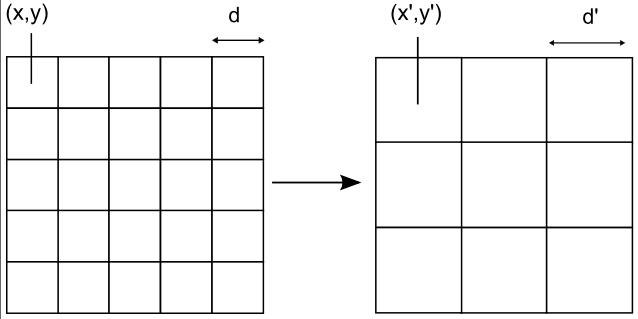
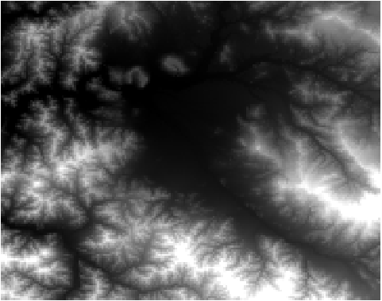

.. _processing.processes.raster.heatmap:

.. warning:: Document Status: **Requires additional technical review and example (MP)**

.. warning:: The name of this process is really confusing. It does not perform an scaling, but a resampling. It should be changed (VO)

ScaleRaster
=======================

Description
-----------

The ``gs:ScaleRaster`` process transforms a raster layer, changing its cellsize and/or translating it. Both operation can be applied independently fo both the *x* and/or *y* axis.

   *gs:ScaleRaster*

The scale parameters define a resampling of the original grid coverage. The resulting grid will have the same extent, but the cellsize is modified.

Inputs and outputs
------------------

This process accepts :ref:`processing.processes.formats.rasterin` and returns :ref:`processing.processes.formats.rasterout`.

Inputs
~~~~~~

.. list-table::
   :header-rows: 1

   * - Name
     - Description
     - Type
     - Usage
   * - ``coverage``
     - Input grid coverage to scale
     - :ref:`GridCoverage2D<processing.processes.formats.rasterin>`
     - Required
   * - ``xScale``
     - Scale factor along the *x* axis
     - Double
     - Required
   * - ``yScale``
     - Scale factor along the *y* axis
     - Double
     - Required
   * - ``xTranslate``
     - Offset along the *x* axis
     - Double
     - Required
   * - ``yTranslate``
     - Offset along the *x* axis
     - Double
     - Required
   * - ``interpolation``
     - The interpolation method to use. The following values are available: NEAREST, BILINEAR, BICUBIC2, BICUBIC
     - Interpolation
     - Required          
   

Outputs
~~~~~~~

.. list-table::
   :header-rows: 1

   * - Name
     - Description
     - Type
   * - ``result``
     - The scaled output grid coverage
     - :ref:`GridCoverage2D <processing.processes.formats.rasterout>`

Usage notes
-----------

* The output grid coverage has the same CRS as the input coverage.
* The translation distance is expressed in the units of the input grid coverage CRS.
* The scale factor must be both have a positive non-zero value. Values larger than 1 cause the resulting cellsize to be smaller than the original cellsize. Values lower than 1 cause the resulting cellsize to be larger than the original cellsize. Since the extent covered by the coverage does not change, the number of cells it contains changes proportionally to the specified scale factor.
* In case of categorical grids or coverages containing discrete variables, the ``NEAREST`` interpolation method must be used. Using any of the other values will cause wrong or meaningless values to appear in the resulting layer.
* Resampling to a smaller cellsize does not increase the precision of the grid coverage, but just make the cells smaller. A resampling operation does not overcome the scale limitations of the original grid.

Examples
--------

Resampling a layer to a coarser resolution
~~~~~~~~~~~~~~~~~~~~~~~~~~~~~~~~~~~~~~~~~~

The following example converts the ``medford:elevation`` grid coverage, creating a new grid coverage that covers the same area but has a cellsize 10 times larger in both the *x* and *y* axis.

Input parameters:

* ``coverage``: ``medford:elevation``
* ``xScale``: 0.1
* ``yScale``: 0.1
* ``xTranslate``: 0
* ``yTranslate``: 0
* ``interpolation``: ``BICUBIC`` 

:download:`Download complete XML request <xml/scaleraster.xml>`

.. figure:: img/scaleRasterUI.png

   *gs:ScaleRaster example parameters*

   *gs:ScaleRaster example result*

