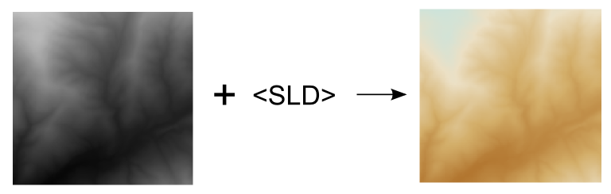
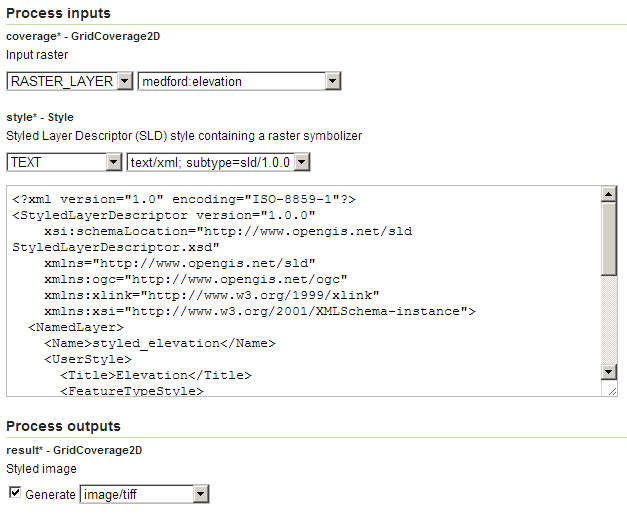
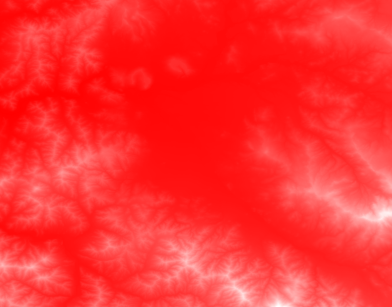

.. _processing.processes.raster.stylecoverage:

StyleCoverage
=============

Description
-----------

The ``gs:StyleCoverage`` process styles a raster using a given SLD and raster symbolizer.

   *gs:StyleCoverage*

Inputs and outputs
------------------

This process accepts :ref:`processing.processes.formats.rasterin` and returns :ref:`processing.processes.formats.rasterout`.

Inputs
~~~~~~

.. list-table::
   :header-rows: 1

   * - Name
     - Description
     - Type
     - Usage
   * - ``coverage``
     - Input grid coverage
     - :ref:`GridCoverage2D <processing.processes.formats.rasterin>`
     - Required
   * - ``style``
     - Styled Layer Descriptor (SLD) style containing a raster symbolizer.
     - Style
     - Required
      

Outputs
~~~~~~~

.. list-table::
   :header-rows: 1

   * - Name
     - Description
     - Type
   * - ``result``
     - Styled coverage
     - :ref:`GridCoverage2D <processing.processes.formats.rasterout>`

Usage notes
-----------

* The resulting coverage has the same extent and CRS of the input coverage.
* The resulting coverage is a rendered image created upon the input coverage and the SLD, and it does not preserve the original values used for the rendering. That means that if the original coverage contains values of elevation, the resulting coverage will not have elevation values and could not be used for the same task. Instead, it will contain color values created based on elevation values and the specified SLD style.

Examples
--------

Styling an elevation layer
~~~~~~~~~~~~~~~~~~~~~~~~~~~~~~~~

The following example creates a styled image using the ``medford:elevation`` coverage and an SLD with a color ramp of red tones.

Input parameters:

* ``coverage``: ``medford:elevation``
* ``style``: 

::

	<?xml version="1.0" encoding="ISO-8859-1"?>
		<StyledLayerDescriptor version="1.0.0" 
		    xsi:schemaLocation="http://www.opengis.net/sld StyledLayerDescriptor.xsd" 
		    xmlns="http://www.opengis.net/sld" 
		    xmlns:ogc="http://www.opengis.net/ogc" 
		    xmlns:xlink="http://www.w3.org/1999/xlink" 
		    xmlns:xsi="http://www.w3.org/2001/XMLSchema-instance">
		  <NamedLayer>
		    <Name>styled_elevation</Name>
		    <UserStyle>
		      <Title>Elevation</Title>
		      <FeatureTypeStyle>
		        <Rule>
		          <RasterSymbolizer>
		            <ColorMap>
		              <ColorMapEntry color="#ff0000" quantity="300" />
		              <ColorMapEntry color="#ff3333" quantity="690" />
		              <ColorMapEntry color="#ff6666" quantity="1080" />
		              <ColorMapEntry color="#ffaaaa" quantity="1470" />
		              <ColorMapEntry color="#ffffff" quantity="1860" />
		            </ColorMap>
		          </RasterSymbolizer>
		        </Rule>
		      </FeatureTypeStyle>
		    </UserStyle>
		  </NamedLayer>
		</StyledLayerDescriptor>``

:download:`Download complete XML request <xml/stylecoverage.xml>`.

   *gs:StyleCoverage example parameters*

The resulting image looks like this:

   *gs:StyleCoverage example output*

