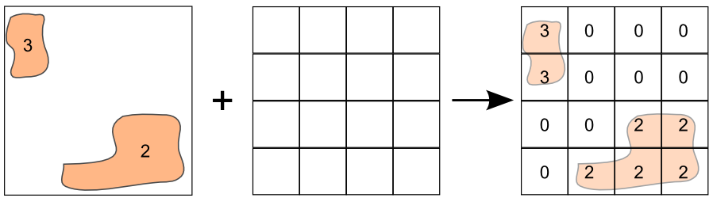
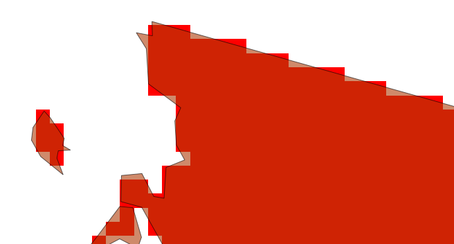

.. _processing.processes.raster.vectortoraster:

.. warning:: Document Status: Requires technical review

VectorToRaster
======================

Description
-----------

The ``gs:VectorToRaster`` process creates a raster coverage from a feature collection. This process is know as *rasterization*.

The process takes a feature collection and one of its attributes, and creates a raster coverage with the values of that attribute in those cells that are covered by the corresponding geometries in the input feature collection.

   *gs:VectorToRaster*

Inputs and outputs
------------------

This process accepts :ref:`processing.processes.formats.fcin` and returns :ref:`processing.processes.formats.rasterout`.

Inputs
^^^^^^

.. list-table::
   :header-rows: 1

   * - Name
     - Description
     - Type
     - Required
   * - ``features``
     - Input collection to rasterize
     - :ref:`SimpleFeatureCollection <processing.processes.formats.fcin>`
     - Yes
   * - ``attribute``
     - The attribute in the feature collection from which to take the values to put in the output grid coverage
     - String
     - Yes     
   * - ``bounds``
     - Envelope representing the bounds of the output grid coverage
     - Envelope
     - No
   * - ``rasterWidth``
     - The width in cells of the output grid coverage
     - Integer
     - Yes
   * - ``rasterHeight``
     - The height in cells of the output grid coverage
     - Integer
     - Yes   
   * - ``title``
     - The name to give to the output grid coverage
     - String
     - No         

Outputs
^^^^^^^

.. list-table::
   :header-rows: 1

   * - Name
     - Description
     - Type
   * - ``result``
     - The output coverage, with the rasterized version of the input feature collection.
     - :ref:`GridCoverage2D <processing.processes.formats.rasterout>`

Usage notes
--------------

- The process can be used with geometries of all types, although its most common usage is with polygon ones.
- The ``bounds`` parameter is optional. If not used, the bounds are taken from the input feature collection, so the output geometry has the minimum extent needed to cover all input features.
- The :term:`CRS` needed to define the ``bounds`` parameter can be different from the :term:`CRS` of the input feature collection to rasterize. In this case, features will be reprojected and then rasterized.
- The ``attribute`` value accepts not just the name of an attribute in the feature collection, but also `ECQL expressions <../../../geoserver/filter/ecql_reference.html>`_ referring to one or several attributes. 
- The selected attribute must be numeric or, in case it is of type ``String``, it must contain just numerical characters, so it can be interpreted as a number. If using an `ECQL expression <../../../geoserver/filter/ecql_reference.html>`_, it must evaluate to a numerical value.
- The output grid coverage can contain only ``int`` and ``float`` values. Values of type ``Double`` in the feature collection will be coerced to ``float``. Values of type ``Long`` will be coerced to ``int``.
- Attributes names are case-sensitive, whether they are used alone or as part of a `ECQL expression <../../../geoserver/filter/ecql_reference.html>`_.
- Cells that are not covered by any of the rasterized geometries will have a no-data value.
- If several geometries overlap over a given cell, that cell will get the value of the latest one to be rasterized. 

Examples
---------

The following example shows how to create a grid coverage from the ``usa:states`` feature collection. The values in the resulting grid coverage correspond to the unique identifier in the *STATE_FIPS* attribute. The extent and dimensions of the resulting coverage are calculated so as to make it cover the whole extent of the feature collection and have a cellsize of 5000 meters in both axis (cells are square). The output coverage is in the Albers Equal Area projection (EPSG:45556).

Input parameters

* ``features``: ``usa:states``
* ``attribute``: ``STATE_FIPS``
* ``bounds``:

  * ``minX``: -2350000
  * ``minY``: -1300000
  * ``maxX``: 2300000
  * ``maxY``: 1600000
  * ``CRS``: ``EPSG:45556``
  
* ``rasterWidth``: 930
* ``rasterHeight``: 580
* ``title``:

:download:`Download complete XML request <xml/vectortorasterexample.xml>`.

.. figure:: img/vectortorasterexampleUI.png  

   *gs:VectorToRaster example parameters*

The following image shows a close up of the resulting grid coverage, along with the original feature collection, to illustrate the rasterization process and the differences between raster and vector version of a same polygon area.

   *gs:VectorToRaster example output*

Related processes
-------------------

- The :ref:`gs:Bounds <processing.processes.vector.clip>` process returns an envelope from a feature collection, so it can be used to define the bounds of the output grid coverage of the ``gs:VectorToRaster`` process. Use it to chain processes, or just to know the extent of the input feature collection, in case you want to manually adjust it, as in the example above.

- In the case of polygons, this process is the inverse of the `gs:PolygonExtraction <processing.processes.vector.raster.polygonextraction>` process, which converts a grid coverage into a polygon feature collection with polygons representing areas in the input grid coverage that have the same value.

- This process is of interest for all those processes that take grid coverages as input, when the data to supply to those algorithm is available as a feature collection.

- When rasterizing a points feature collection, most cells in the resulting layer are likely to have no data, unless the points are densely packed or the cellsize (determined by the number of cells in the ``rasterWidth`` and ``rasterHeight`` parameters is large). To create a grid coverage with values in all cells by using interpolation methods, use an interpolation process such as `gs:BarnesSurface <processing.processes.raster.barnessurface>`.

