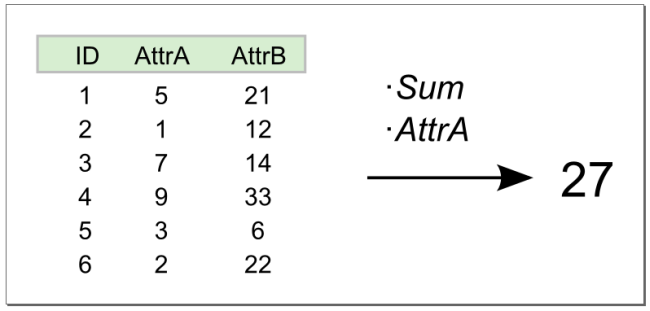
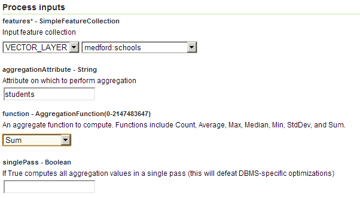
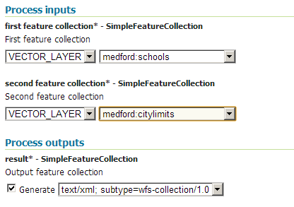
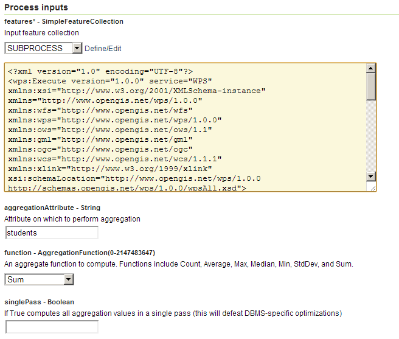

.. _processing.processes.vector.aggregate:

.. warning:: Document Status: **Requires technical review**

Aggregate
=========

Description
-----------

The ``gs:Aggregate`` process calculates one or more statistics for a given attribute for a feature collection. The available statistical values to calculate are:

* **Mean**—Calculates the mean for a given value over all features
* **Min**—Calculates the minimum value over all features
* **Max**—Calculates the maximum value over all features
* **StdDev**—Calculates the standard deviation of a given value over all features
* **Count**—Calculates the number of features
* **Sum**—Calculates the sum of a given attribute value over all features

  
   *gs:Aggregate*

Inputs and outputs
------------------

This process accepts :ref:`processing.processes.formats.fcin` and returns a numerical value.

Inputs
~~~~~~

.. list-table::
   :header-rows: 1

   * - Name
     - Description
     - Type
     - Required
   * - ``features``
     - Input collection of point features to calculate statistics from
     - :ref:`SimpleFeatureCollection <processing.processes.formats.fcin>`
     - Yes
   * - ``aggregationAttribute``
     - Attribute to use for calculating statistics
     - String
     - Yes
   * - ``function``
     - Functions to calculate for the selected attribute.  Can be one of ``Mean``, ``Min``, ``Max``, ``StdDev``, ``Count``, ``Sum``
     - String
     - Yes     
   * - ``singlePass``
     - If set to ``true``, calculations are done in a single pass. Default is ``false``.
     - Boolean
     - No

.. todo:: Single pass as opposed to what?

Outputs
~~~~~~~

.. list-table::
   :header-rows: 1

   * - Name
     - Description
     - Type
   * - ``result``
     - Result of the calculation
     - Value

Usage notes
-----------

* The ``aggregationAttribute`` input parameter is case-sensitive.
* When using ``Count`` function, the ``aggregationAttribute`` input parameter is ignored.

Examples
--------

Total number of students
~~~~~~~~~~~~~~~~~~~~~~~~

This example calucates the total number of students in the schools represented by the ``medford:schools`` layer.

Input parameters:
    
* ``features``: ``medford:schools``
* ``aggregationAttribute``: ``students``
* ``function``: ``Sum``
* ``singlePass``: ``False``

:download:`Download complete XML request <xml/aggregateexample.xml>`.

   *gs:Aggregate example parameters*

The result shows the total number of students at **22342**.

.. code-block:: xml

   <AggregationResults>
     <Sum>22342.0</Sum>
   </AggregationResults>

Total number of students in a given area
~~~~~~~~~~~~~~~~~~~~~~~~~~~~~~~~~~~~~~~~

This example calculates the total number of students in the schools represented by the ``medford:schools`` layer, but within the city limits as represented by the ``medford:citylimits`` layer. This is accomplished with a process chain: the :ref:`gs:InclusionFeatureCollection <processing.processes.vector.inclusionfc>` process is used to get a filtered collection of schools within the city limits, and then that resulting collection is used as input for the ``gs:Aggregate`` process.

Inputer parameter for ``gs:InclusionFeatureLayer``:

* ``first feature collection``: ``medford:schools``
* ``second feature collection``: ``medford:citylimits``

Input parameters for ``gs:Aggregate``:
    
* ``features``: output from ``gs:InclusionFeatureLayer``
* ``aggregationAttribute``: ``students``
* ``function``: ``Sum``
* ``singlePass``: ``False``

:download:`Download complete XML request <xml/aggregateexample2.xml>`.

   *gs:Aggregate example parameters (Part 1)*

   *gs:Aggregate example parameters (Part 2)*

The result shows the total number of students at **13432**.    

.. code-block:: xml

   <AggregationResults>
     <Sum>13432.0</Sum>
   </AggregationResults>

