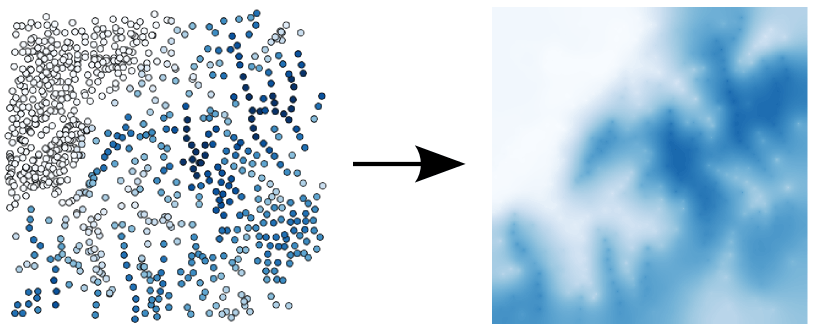
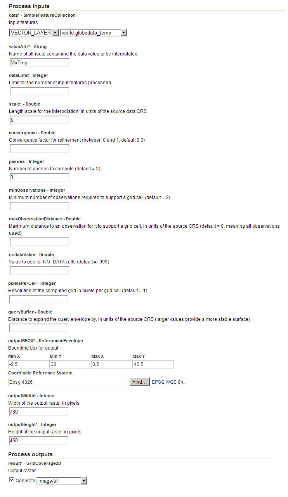
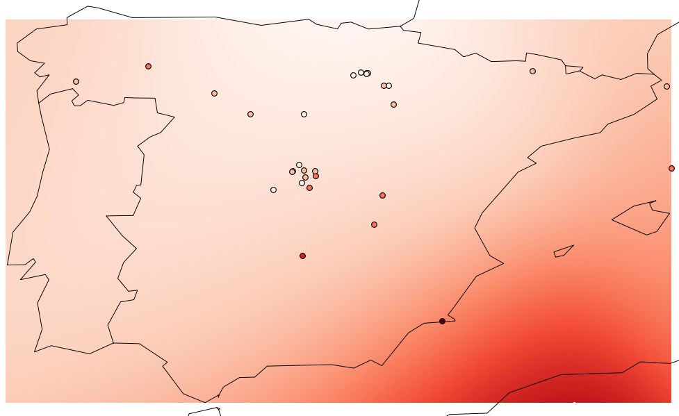

.. _processing.processes.vector.barnessurface:

.. warning:: Document Status: **Requires questions answered and images edited (MP)**

BarnesSurface
=============

.. todo:: This page collides with the Rendering Transformations page on Barnes Surface. Need to figure out the difference between them. Suggest: Remove theory/usage from RT page, and link to here.

Description
-----------

The ``gs:BarnesSurface`` process computes an interpolated surface over a set of irregular data points. Surface values are computed using the `Barnes interpolation algorithm <http://en.wikipedia.org/wiki/Barnes_interpolation>`_. 

   *gs:BarnesSurface*

The ``gs:BarnesSurface`` process can be used as a :ref:`rendering transformation <cartography.rt.barnes>`.

Inputs and outputs
------------------

This process accepts :ref:`processing.processes.formats.fcin` and returns :ref:`processing.processes.formats.rasterout`

Inputs
~~~~~~

.. list-table::
   :header-rows: 1

   * - Name
     - Description
     - Type
     - Usage
   * - ``data``
     - Input points feature collection
     - :ref:`SimpleFeatureCollection <processing.processes.formats.fcin>`
     - Required
   * - ``valueAttr``
     - Name of attribute containing the data value to be interpolated
     - String
     - Required
   * - ``dataLimit``
     - Limit for the number of input features processed
     - Integer
     - Optional
   * - ``scale``
     - Length scale for the interpolation in units of the source data CRS
     - Double
     - Required
   * - ``convergence``
     - Convergence factor for refinement (between 0 and 1, default is 0.3)
     - Double
     - Optional
   * - ``passes``
     - Number of passes to compute (default is 2)
     - Integer
     - Optional
   * - ``minObservations``
     - Minimum number of observations required to support a grid cell (default is 2)
     - Integer
     - Optional
   * - ``maxObservationDistance``
     - Maximum distance to an observation for it to support a grid cell, in units of the source CRS (default is 0, meaning all observations used). 
     - Double
     - Optional
   * - ``noDataValue``
     - Value to use for NO_DATA cells (default is -999)
     - Double
     - Optional
   * - ``pixelsPerCell``
     - Resolution of the computed grid in pixels per grid cell (default is 1)
     - Integer
     - Optional
   * - ``queryBuffer``
     - Distance to expand the query envelope by, in units of the source CRS (larger values provide a more stable surface)
     - Double
     - Optional                                        
   * - ``outputBBOX``
     - Bounding box for output  
     - ReferencedEnvelope
     - Required
   * - ``outputWidth``
     - Width of the output raster in pixels
     - Integer
     - Required                                        
   * - ``outputHeight``
     - Height of the output raster in pixels  
     - Integer
     - Required                                                  

Outputs
~~~~~~~

.. list-table::
   :header-rows: 1

   * - Name
     - Description
     - Type
   * - ``result``
     - Output interpolated grid coverage
     - :ref:`GridCoverage2D <processing.processes.formats.rasterout>`

Usage notes
-----------

* The attribute to use from input feature collection (``valueAttr``) must be of numeric type. Null values are allowed, but features having a null value for the selected attribute will be ignored.
* The input points feature collection can have a CRS different to the CRS of the ``outputBBox`` parameter. In that case, points are reprojected before interpolating.
* A minimum number of points (indicated by the ``minObservations`` parameter) is needed to assign a value to a given cell. If the number of points in the defined neighborhood of the cell is lower than the minimum number of required points, the cell will get the ``NODATA`` value. This value can be set using the optional ``noDataValue`` parameter.
* Using a lower value of the ``maxObservationDistance`` parameter implies a better accuracy, since fewer points are used to calculate the value at a given cell, but it may cause more cells to be populated with a ``NODATA`` value, if the number of observations within the maximum observation distance is lower than the required minimum (``minObservations``)
* The Barnes interpolation is only suitable for interpolating continuous values, and not for categorical values where in intermediate value would not make sense.

.. todo:: Give a quick example of a data set where Barnes would not be suitable.

Examples
--------

Creating a max temperature coverage from station data
~~~~~~~~~~~~~~~~~~~~~~~~~~~~~~~~~~~~~~~~~~~~~~~~~~~~~

The ``world:globedata_temp`` layer contains several temperature measures for a set of stations. Using its ``MxTmp`` attribute, which contains maximum temperature values, this example will use the ``gs:BarnesSurface`` process to generate a coverage consisting of maximum temperatures for the entire Earth.

Input parameters:

* ``data``: ``world_globedata_temp``
* ``valueAttr``: ``MxTmp``
* ``dataLimit``: [Blank]
* ``scale``: 15
* ``convergence``: [Blank]
* ``passes``: 3
* ``minObservations``: 2
* ``maxObservationDistance``: 15
* ``noDataValue``: [Blank]
* ``pixelsPerCell``: 8
* ``queryBuffer``: [Blank]
* ``outputBBOX``: 

  * ``minX``: -180
  * ``minY``: -90
  * ``maxX``: 180
  * ``maxY``: 90
  * ``CRS``: ``EPSG:4326`` 

* ``outputWidth``: 720
* ``outputHeight``: 360

:download:`Download complete XML request <xml/barnesexample.xml>`.

   *gs:BarnesSurface example parameters*

The resulting coverage looks like this, displayed along with the input points:

   *gs:BarnesSurface example output*

.. todo:: Shouldn't this graphic show a smooth gradient, not stepped?

Related processes
-----------------

*  The :ref:`gs:VectorToRaster <processing.processes.vector.vectortoraster>` process performs a similar vector-to-raster conversion, but does not use interpolation.

