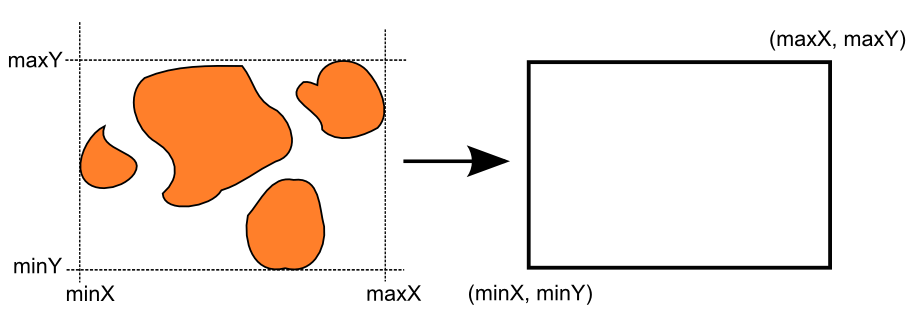
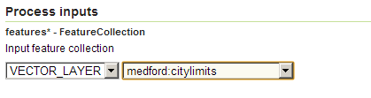

.. _processing.processes.vector.bounds:

.. warning:: Document Status: **Requires copyedit review (MP)**

Bounds
======

Description
-----------

The ``gs:Bounds`` process takes a feature collection and returns the bounding box of its features. 

   
   *gs:Bounds*

Inputs and outputs
------------------

This process accepts :ref:`processing.processes.formats.fcin` and returns bounding box values.

Inputs
~~~~~~

.. list-table::
   :header-rows: 1

   * - Name
     - Description
     - Type
     - Required
   * - ``features``
     - Input feature collection
     - :ref:`SimpleFeatureCollection <processing.processes.formats.fcin>`
     - Yes

Outputs
~~~~~~~

.. list-table::
   :header-rows: 1

   * - Name
     - Description
     - Type
   * - ``bounds``
     - Bounding box
     - ReferencedEnvelope

Usage notes
-----------

* The input feature collection can contain any type of geometries.
* The coordinates of the bounding box are expressed in the same :term:`CRS` as the input feature collection.

Examples
--------

The following example calculates the bounding box of the ``medford:citylimits`` feature collection.

Input parameters:

* ``features``: ``medford:citylimits``

:download:`Download complete XML request <xml/boundsexample.xml>`.

   *gs:Bounds example parameters*

The output is a ``ReferencedEnvelope`` object, representing the rectangle with the following coordinates:

``((-122.91114387175001 42.28876047432729) (-122.77716656020742 42.39838210872112))``

.. code-block:: xml

   <ows:BoundingBox crs="EPSG:4326">
     <ows:LowerCorner>-122.91114387175001 42.28876047432729</ows:LowerCorner>
     <ows:UpperCorner>-122.77716656020742 42.39838210872112</ows:UpperCorner>
   </ows:BoundingBox>

Related processes
-------------------

This process is of interest for all those processes requiring an inut of type ``ReferenceEnvelope``. Chaining it with them can be used to automatically specify the envelope that covers the extent of a given feature collection.