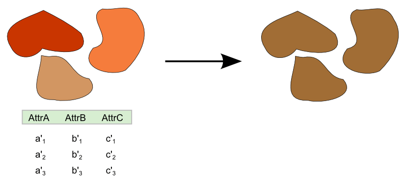

.. _processing.processes.vector.collectgeometries:

.. warning:: Document Status: **Requires copyedit review (MP)**

CollectGeometries
=================

Description
-----------

The ``gs:CollectGeometries`` process takes all features in a feature collection and returns a single ``GeometryCollection`` object. This allows using geometries from feature collections in processes that require an input of type ``Geometry``.

   
   *gs:CollectGeometries*

Inputs and outputs
------------------

This process accepts :ref:`processing.processes.formats.fcin` and returns :ref:`processing.processes.formats.geomout`.

Inputs
~~~~~~

.. list-table::
   :header-rows: 1

   * - Name
     - Description
     - Type
     - Required
   * - ``features``
     - Input feature collection
     - :ref:`SimpleFeatureCollection <processing.processes.formats.fcin>`
     - Yes

Outputs
~~~~~~~

.. list-table::
   :header-rows: 1

   * - Name
     - Description
     - Type
   * - ``result``
     - Geometry containing features from the input feature collection
     - :ref:`GeometryCollectionCollection <processing.processes.formats.geomout>`

Usage notes
-----------

* The :term:`CRS` of the resulting geometry is the same as the input feature collection.

Related processes
-----------------

* This process is useful for all those processes taking inputs of type :ref:`Geometry <processing.processes.geometry>`, as it can "convert" feature collections to geometries. To see an example of such usage, see the Examples section for the :ref:`gs:Clip <processing.processes.vector.clip>` process.
* To perform the opposite conversion and generate a feature collection from a geometry, use the :ref:`gs:Feature <processing.processes.vector.feature>` process.

