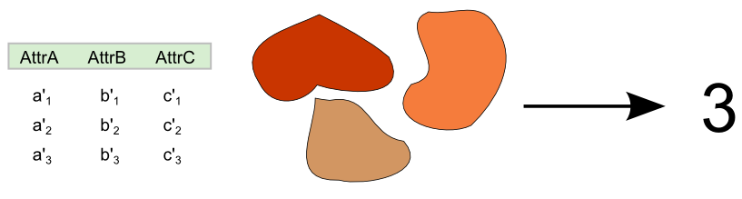

.. _processing.processes.vector.count:

.. warning:: Document Status: Requires technical review

Count
=======

Description
-----------

The ``gs:Count`` process takes a feature collection and returns the number of features that it contains.

   *gs:Count*

Inputs and outputs
------------------

This process accepts :ref:`processing.processes.formats.fcin` 

Inputs
^^^^^^

.. list-table::
   :header-rows: 1

   * - Name
     - Description
     - Type
     - Required
   * - ``features``
     - Input feature collection
     - :ref:`SimpleFeatureCollection <processing.processes.formats.fcin>`
     - Yes

Outputs
^^^^^^^

.. list-table::
   :header-rows: 1

   * - Name
     - Description
     - Type
   * - ``bounds``
     - The number of features in the feature collection
     - Number

Examples
---------

The following example calculates the number of volcanoes from the ``world:volcanoes`` feature collection.

Input parameters

* ``features``: ``world:volcanoes``

:download:`Download complete XML request <xml/bufferfcexample.xml>`.

.. figure:: img/countexampleUI.png

   *gs:Count example parameters*

The process yields a result of 1268.

Usage notes
--------------

- The number of features might not match the number of simple geometries in the feature collection, since multi-geometries might exist. In other words, the result of this process is not necessarily the number of geometries that can be seen in the rendered feature collection.

Relationship to other processes
-------------------------------

- To count the number of features in a given area defined by a polygon, you can clip the input feature collection using the `gs:Clip <processing.processes.vector.clip>` process and use the resulting feature collection. 

- In the case of several polygons, use the ``gs:VectorZonalStats`` process, which calculates statistical values of features with geometries within each polygon, among them the number of features.

