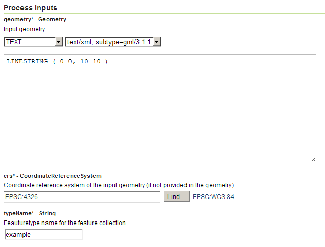

.. _processing.processes.vector.feature:

Feature
=======

Description
-----------

The ``gs:Feature`` process converts a geometry into a feature collection containing a single feature, with a single attribute containing the value of the input geometry.

This process is used for providing an geometry as input to other processes that require feature collections as input.
   
Inputs and outputs
------------------

This process accepts :ref:`processing.processes.formats.geomin` and returns :ref:`processing.processes.formats.fcout`.

Inputs
~~~~~~

.. list-table::
   :header-rows: 1

   * - Name
     - Description
     - Type
     - Required
   * - ``geometry``
     - Input geometry
     - Geometry
     - Yes
   * - ``crs``
     - CRS identifier
     - String
     - No
   * - ``typeName``
     - Typename for generated feature collection
     - String
     - Yes

Outputs
~~~~~~~

.. list-table::
   :header-rows: 1

   * - Name
     - Description
     - Type
   * - ``result``
     - Generated feature
     - :ref:`FeatureCollection <processing.processes.formats.fcout>`
     
Usage notes
-----------

* A :term:`CRS` identifier can be provided to indicate the CRS of the geometry. The identifier is a standard EPSG code, such as ``EPSG:4326``. Some geometry input formats (such as GML) allow specifying the geometry CRS directly.
* The name of the output attribute containing the geometry is ``geom``.
* No other attributes are created.

Examples
--------

The following example converts a WKT linestring in WGS84 into a feature collection.

Input parameters:

* ``geometry``: ``LINESTRING (0 0, 10 10)``
* ``crs``: ``EPSG:4326``
* ``typeName``: ``example``

:download:`Download complete XML request <xml/featureexample.xml>`.

   *gs:Feature example parameters*

Relationship to other processes
-------------------------------

* The :ref:`gt:CollectGeometries <processing.processes.vector.collectgeoms>` process is the inverse of this process—it converts a feature collection into a single geometry.
* If additional scalar-valued attributes are needed, they can be added by chaining this process into the :ref:`gs:Transform <processing.processes.vector.transform>`  process.
