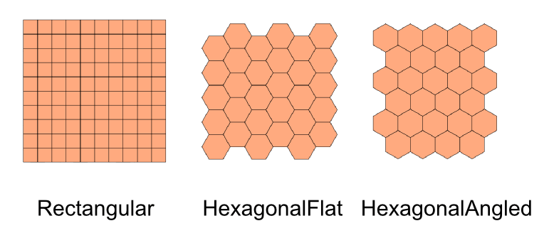
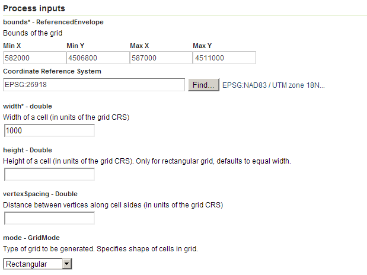
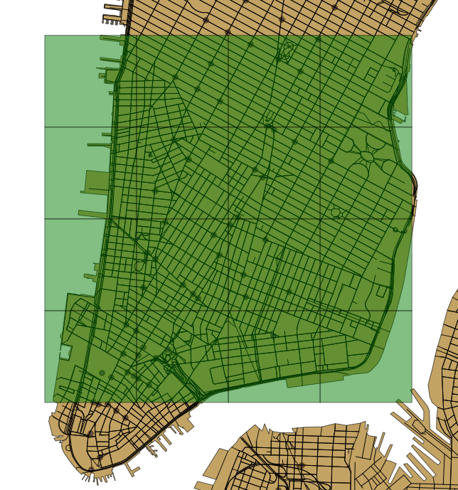

.. _processing.processes.vector.grid:

.. warning:: Document Status: Requires technical review

Grid
====

Description
-----------

The ``gs:Grid`` process creates a feature collection with a regular grid of polygons covering a given area.

Polygons can be rectangular or hexagonal and they can have spacing between them of be contiguous, so every point in the defined area to cover belongs to one and only one of the resulting polygons. In this case, the resulting polygons will form a space partition.

Three additional attributes are added to each polygon representing a cell in the output grid: 

- ``id``: a unique value to identify the polygon.
- ``centerX``: the X ordinate of the center of the polygon.
- ``centerY``: the Y ordinate of the center of the polygon.

   *gs:Grid*

Inputs and outputs
------------------

This process returns :ref:`processing.processes.formats.fcout`.

Inputs
^^^^^^

.. list-table::
   :header-rows: 1

   * - Name
     - Description
     - Type
     - Required
   * - ``bounds``
     - The bounds of the region to cover with the resulting grid
     - ReferencedEnvelope
     - Yes
   * - ``width``
     - The width of each of the polygons in the grid
     - Double
     - Yes
   * - ``height``
     - The height of each of the polygons in the grid. This parameter is used only if the resulting polygons are rectangular. If it is not set, the value of the ``width`` parameter is taken, so the resulting polygons will be squares
     - Double
     - No     
   * - ``vertexSpacing``
     - The space to leave between adjacent polygons. If not set, no space is left (default value is 0)
     - Double
     - No    
   * - ``mode``
     - This parameter determines the shape of the resulting polygons. Available options are rectangular and hexagonal.
     - GridMode
     - No    

Outputs
^^^^^^^

.. list-table::
   :header-rows: 1

   * - Name
     - Description
     - Type
   * - ``result``
     - The resulting grid feature collection
     - :ref:`SimpleFeatureCollection <processing.processes.formats.fcout>`

Usage notes
--------------

* The ``width``, ``height`` and ``vertexSpacing`` inputs should be expressed in the units of the CRS defined by the ``bounds`` parameter.
* Both ``centerX`` and ``centerY`` attributes in the output feature collection are also expressed in the units of the feature collection's CRS.
* The ``width`` value is used as the radius of the hexagon, so in practice the resulting hexagons have a width twice the entered ``width`` value, as can be seen in the description image above.

Examples
---------

The following example creates a grid of 1km x 1km square cells roughly covering the southern half of Manhattan.

Input parameters 

* ``bounds``

  * ``minX``: 582000
  * ``maxX``: 587000
  * ``minY``: 4506800
  * ``maxY``: 4511000
  * ``CRS``: ``EPSG:26918``

* ``width``: 1000
* ``mode``: ``Rectangular``

:download:`Download complete XMl request <xml/gridexample.xml>`.

   *gs:Grid example parameters*

   *gs:Grid example output*

Related processes
---------------------------------

* See the documentation for the ``gs:VectorZonalStatistics`` to see a practical use of the ``gs:Grid`` algorithm to create a hex-binning rendering of a point feature collection.

