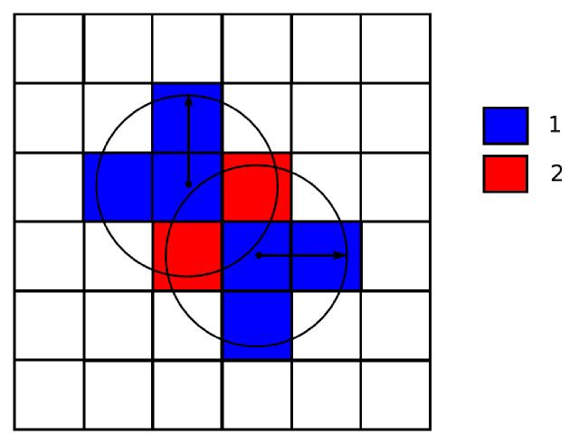
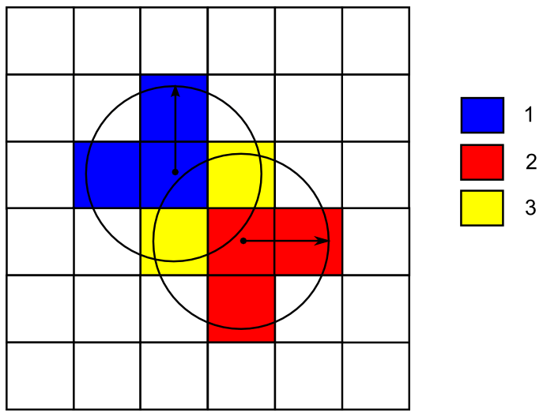
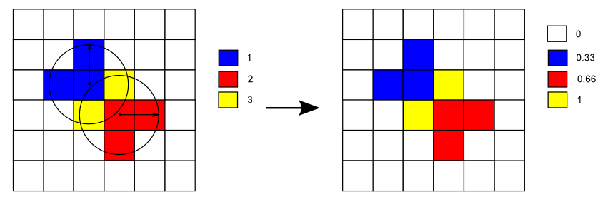
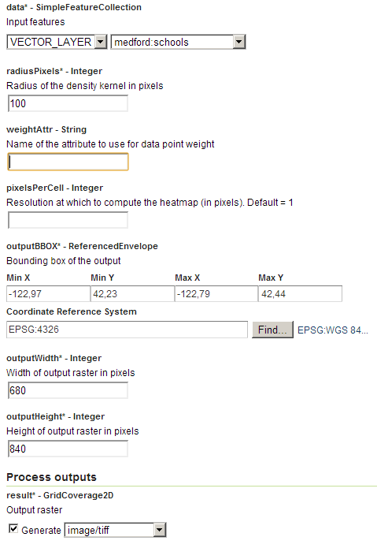
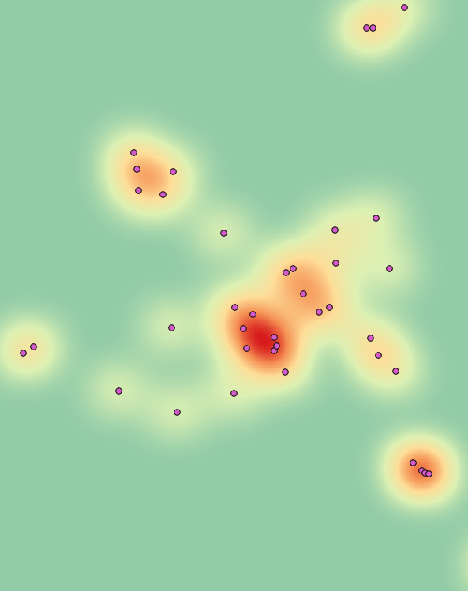
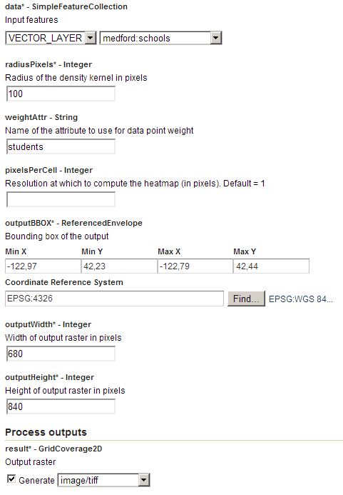
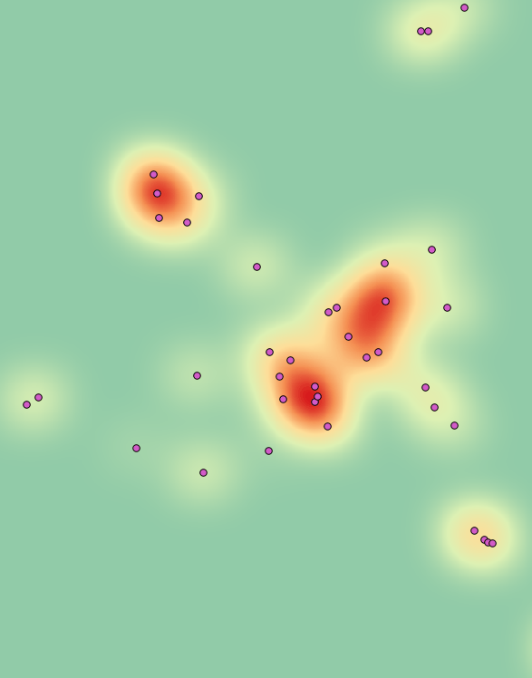

.. _processing.processes.vector.heatmap:

.. warning:: Document Status: **Requires images edited and questions answered (MP)**

Heatmap
=======

Description
-----------

The ``gs:Heatmap`` process takes a points feature collection and generates a raster layer representing the density of those features.

Calculation is done by taking a given radius around each cell of the resulting grid coverage and adding up the values from features falling within that radius. The "influence" of a feature is determined by its distance to the cell. Specifically, a `Gaussian function <http://en.wikipedia.org/wiki/Gaussian_function>`_ is used to calculate the influence of a given feature occurrence at a given distance. 

   *gs:Heatmap*

Features can be weighted to indicate that the influence of a feature should be lower or higher. For instance, if the resulting grid coverage will be a population density coverage, and it is to be created from points representing cities, features should be weighted using the corresponding attribute which represents the population of each city.

   *gs:Heatmap weighted*

Once the density coverage has been computed, it is normalized to have values within in the [0,1] range.

   *gs:Heatmap final normalized output*

Inputs and outputs
------------------

This process accepts :ref:`processing.processes.formats.fcin` and returns :ref:`processing.processes.formats.rasterout`.

Inputs
~~~~~~

.. list-table::
   :header-rows: 1

   * - Name
     - Description
     - Type
     - Usage
   * - ``data``
     - Input feature collection
     - :ref:`SimpleFeatureCollection <processing.processes.formats.fcin>`
     - Required
   * - ``radiusPixels``
     - Radius of the density kernel in pixels
     - Integer
     - Required
   * - ``weightAttr``
     - Name of the attribute to use for data point weight
     - String
     - Optional
   * - ``pixelsPerCell``
     - Resolution at which to compute the heatmap (in pixels). Default = 1
     - Integer
     - Optional
   * - ``outputBBOX``
     - Bounding box of the output
     - ReferencedEnvelope
     - Required     
   * - ``outputWidth``
     - Width of output raster in pixels
     - Integer
     - Required
   * - ``outputHeight``
     - Width of output raster in pixels
     - Integer
     - Required     

Outputs
~~~~~~~

.. list-table::
   :header-rows: 1

   * - Name
     - Description
     - Type
   * - ``result``
     - Output heatmap
     - :ref:`GridCoverage2D <processing.processes.formats.rasterout>`

Usage notes
-----------

* The values of the weighting attribute  (``weightAttr``) must resolve to a numeric value, otherwise the feature will have a weight value of 1.
* The values of the weighting attribute (``weightAttr``) do not affect the range of values in the output grid coverage, as the range is always normalized to 1. The resulting coverage represents the probability distribution of the process represented by the input feature collection.
* While this process is typically used with point features, all types of features are accepted. If features other than points are used, the centroid of the geometry is used as its representative point.
* The output coverage is produced in the CRS of the envelope selected in the ``outputBBOX`` parameter. Input features can have a different CRS, and they will be reprojected if needed into that output CRS before computing the heatmap.

Examples
--------

Calculating a heatmap of schools
~~~~~~~~~~~~~~~~~~~~~~~~~~~~~~~~

.. todo:: This example text doesn't match the example. What is this supposed to be?

The following example creates a heatmap based on the ``medford:schools`` layer.

Input parameters:

* ``data``: ``medford:schools``
* ``radiusPixels``: 100
* ``weightAttr``: [Blank]
* ``pixelsPerCell``: [Blank]
* ``outputBBOX``: 

  * ``minX``: -122.97
  * ``minY``: 42.23
  * ``maxX``: -122.80
  * ``maxY``: 42.44
  * ``CRS``: ``EPSG:4326`` 

* ``outputWidth``: 680
* ``outputHeight``: 840

:download:`Download complete XML request <xml/heatmap.xml>`.

   *gs:Heatmap example parameters*

The resulting heatmap looks like this:

   *gs:Heatmap example output*

The above result represents the density of school buildings. To compute a density map of students in those schools places, the input feature collection can be weighted by adding the ``weightAttr`` parameter, and setting it to the ``students`` attribute. This attribute shows the number of students in each school.

Input parameters:

* ``data``: ``medford:schools``
* ``radiusPixels``: 100
* ``weightAttr``: ``students``
* ``pixelsPerCell``: [Blank]
* ``outputBBOX``: 

  * ``minX``: -122.97
  * ``minY``: 42.23
  * ``maxX``: -122.80
  * ``maxY``: 42.44
  * ``CRS``: ``EPSG:4326`` 

* ``outputWidth``: 680
* ``outputHeight``: 840

:download:`Download complete XML request <xml/heatmap2.xml>`.

   *gs:Heatmap example parameters*

The resulting heatmap has a slightly different output than before.

   *gs:Heatmap example output (weighted)*

Related processes
-----------------
* This process requires an input of type ``ReferenceEnvelope`` (the ``outputBBOX`` parameter). The ``ReferenceEnvelope`` class represents a bounding box expressed as its four coordinates (``minX, maxX, minY, maxY``) and a CRS. This parameter is used to set the area covered by the output grid coverage.  Instead of manually entering the coordinates and CRS of the parameter, the ``gs:Bounds`` process can be used to extract the required envelope from a given feature collection. Particularly, it is of interest to extract the envelope of the same layer used as input for the ``gs:Heatmap`` process so the envelope of the output coverage is that of the input feature collection.

