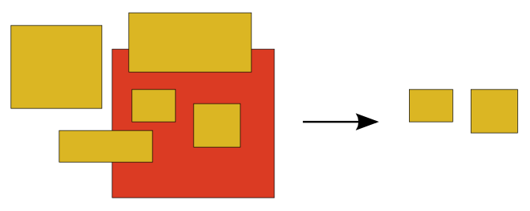
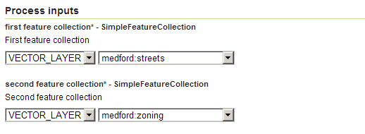
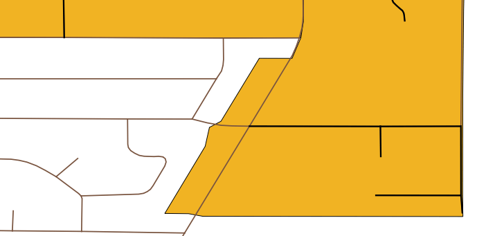

.. _processing.processes.inclusionfc:

.. warning:: Document Status: Requires technical review

InclusionFeatureCollection
=============================

Description
-----------

The ``gs:InclusionFeatureCollection`` process takes two feature collections and returns a new one that contains the features from the first input collection which are spatially contained within at least one feature from the second one.

This process acts as a filter and do not modifies neither geometries nor other attribute, just leaving out those features from the first feature collection not contained within the features of the second one.

   *gs:InclusionFeatureCollection*

Inputs and outputs
------------------

This process accepts :ref:`processing.processes.formats.fcin` and returns :ref:`processing.processes.formats.fcout`.

Inputs
^^^^^^

.. list-table::
   :header-rows: 1

   * - Name
     - Description
     - Type
     - Required
   * - ``first feature collection``
     - First feature collection, which contains the features that will be filtered to create the resulting feature collection.
     - SimpleFeatureCollection
     - Yes
   * - ``second feature collection``
     - Second feature collection. Only features from the first feature collection contained within the features of this one will be added to the resulting feature collection.
     - :ref:`SimpleFeatureCollection <processing.processes.formats.fcin>`
     - Yes

Outputs
^^^^^^^

.. list-table::
   :header-rows: 1

   * - Name
     - Description
     - Type
   * - ``result``
     - Output feature collection
     - :ref:`SimpleFeatureCollection <processing.processes.formats.fcout>`

Usage notes
--------------

* Input feature collections can be of any geometry type, and the process performs no geometry check of any kind. However, using a feature collection of polygons for the ``second feature collection`` parameter is the most common case.

Examples
---------

The following example illustrates the usage of the *gs:InclusionFeatureCollection* process.

Using ``medford:streets`` and ``medford:zoning`` feature collections to get a resulting feature collection with just those streets that are completely contained within just one zone.

Input parameters
    
* ``first feature collection``: ``medford:streets``
* ``second feature collection``: ``medford:zoning``      

   *gs:InclusionFeatureCollection example parameters*

:download:`download complete XML request <xml/inclusionfcexample.xml>`.

The image below represents a close up of both input feature collections along with the output one (in black). It can be noticed how streets that are partially contained within a zone (that cross it), are not part of the final feature collection, since it contains just those ones fully contained.

   *gs:InclusionFeatureCollection example output*

Related processes
------------------

- The ``gs:InclusionFeatureCollectionProcess`` differs from other overlay processes like :ref:`gs:Clip<processing.processes.vector.clip>` or :ref:`gs:IntersectionFeatureCollection<processing.processes.vector.intersectionfc>` in that the geometries are not modified, and the secondary feature collection is used to filter, but not to alter the geometries in the first feature collection. 