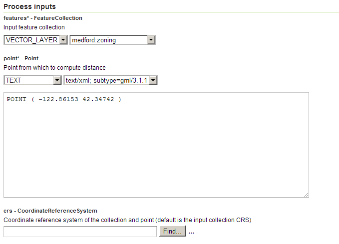
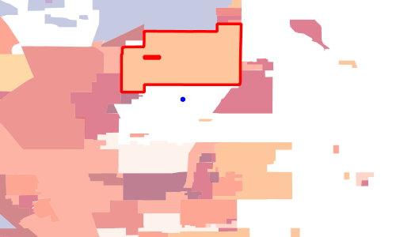

.. _processing.processes.vector.nearest:

.. warning:: Document Status: **Requires copyedit review (MD)**

Nearest
=======

Description
-----------

The ``gs:Nearest`` process finds the feature which is nearest to a given point location.
The distance and bearing to the point are added to the output feature.
The distance computed is the geodetic distance between the input point 
and the closed point on the nearest feature.
   
Inputs and outputs
------------------

This process accepts :ref:`processing.processes.formats.fcin` and returns :ref:`processing.processes.formats.fcout`.

Inputs
^^^^^^

.. list-table::
   :header-rows: 1
   :widths: 25 35 20 20

   * - Name
     - Description
     - Type
     - Required
   * - ``features``
     - Input features
     - :ref:`FeatureCollection <processing.processes.formats.fcin>`
     - Yes
   * - ``point``
     - Point to compute distance from
     - Geometry
     - Yes
   * - ``crs``
     - CRS identifier
     - String
     - No

Outputs
^^^^^^^

.. list-table::
   :header-rows: 1
   :widths: 25 35 40

   * - Name
     - Description
     - Type
   * - ``result``
     - Nearest feature
     - :ref:`FeatureCollection <processing.processes.formats.fcout>`
     
Usage notes
--------------

* A coordinate reference system (CRS) identifier can be optionally provided to 
  indicate the CRS of the geometry.
  The CRS identifier is a standard EPSG code, such as ``EPSG:4326``.
  If the parameter is omitted the point is assumed to be
  in the CRS of the input features.
* The output feature has the following additional attributes:

  - ``nearest_distance`` contains the distance to the point, in the units of the input CRS
  - ``nearest_bearing`` contains the bearing to the point, in decimal degrees

Examples
---------

The following example finds the Medford zoning polygon nearest to the point (-122.86153, 42.34742).

Parameter inputs:

- ``features``: ``medford:zoning``
- ``point``: ``POINT ( -122.86153 42.34742 )``

:download:`Download complete XMl request <xml/nearestexample.xml>`.

   *gs:Nearest example parameters*

   *Nearest zoning polygon (red) to a point (blue)*

