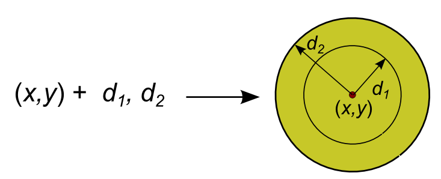
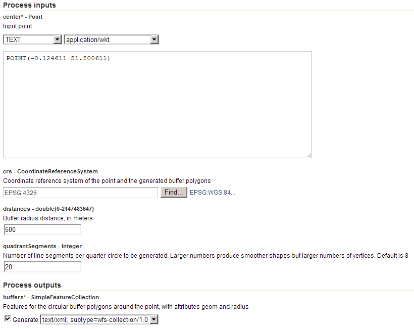
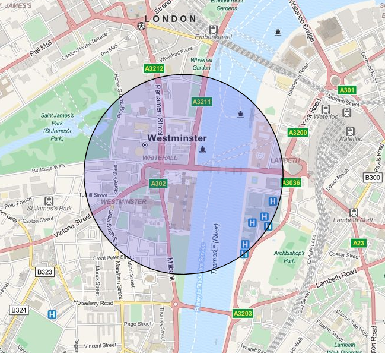

.. _processing.processes.vector.pointbuffers:

.. warning:: Document Status: **Requires copyedit review (MP)**

PointBuffers
============

Description
-----------

The ``gs:PointBuffers`` process returns a collection of circular buffer polygons with specified radii centered on a given point.

   *gs:PointBuffers*

The output feature collection contains the geometry and an additional attribute named *radius*, with the radius of the corresponding polygon.

Inputs and outputs
------------------

``gs:BufferFeatureCollection`` accepts :ref:`processing.processes.formats.geomin` and returns :ref:`processing.processes.formats.fcout`.

Inputs
~~~~~~

.. list-table::
   :header-rows: 1

   * - Name
     - Description
     - Type
     - Usage
   * - ``center``
     - Input point
     - :ref:`Point <processing.processes.formats.geomin>`
     - Required
   * - ``crs``
     - Coordinate reference system of the point and the generated buffer polygons
     - CoordinateReferenceSystem
     - Required
   * - ``distances``
     - Buffer radius distances
     - double
     - Required
   * - ``quadrantSegments``
     - Number of line segments per quarter-circle to be generated. Larger numbers produce smoother shapes but larger numbers of vertices. Default is 8 
     - Integer
     - Optional     

Outputs
~~~~~~~

.. list-table::
   :header-rows: 1

   * - Name
     - Description
     - Type
   * - ``buffers``
     - Buffered feature collection
     - :ref:`SimpleFeatureCollection <processing.processes.formats.fcout>`

Usage notes
-----------

* The output feature collection has the CRS specified in the ``crs`` parameter.
* The buffer distances are assumed to be in meter, even if the selected uses different units.
* The value in the *radius* attribute matches the corresponding entered value in meters, even if the CRS of the output feature collection does not use meters as unit.

Examples
--------

The following example generates a 500 meter buffer around the location of London's Big Ben. The center point is entered using a WKT string.

Input parameters:

* ``point``: ``POINT(-0.124611 51.500611)``
* ``distance``: 500 
* ``crs``: EPSG:4326
* ``quadrantSegments``: 20

:download:`Download complete XML request <xml/pointbuffersexample.xml>`

   *gs:BufferFeatureCollection example parameters*

   *gs:PointBuffers example output*

Related processes
-----------------

* Buffer calculation is also available with the :ref:`gs:Transform <processing.processes.vector.transform>` process, using the ``buffer(geom, dist)`` function.
* The ``JTS:buffer`` process will perform buffer calculation for geometries.
* The :ref:`gs:BufferFeatureCollection<processing.processes.vector.bufferfc>` process can be used to buffer all the features in a feature collection.

