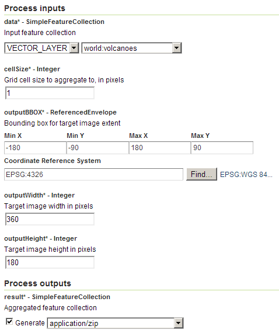
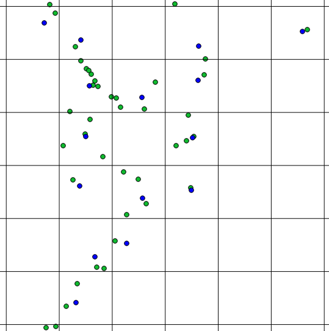

.. _processing.processes.vector.pointstacker:

.. warning:: Document Status: **Requires copyedit review (MP) and missing intro figure**

PointStacker
============

Description
-----------

The ``gs:PointStacker`` process aggregates a collection of points over a grid into one point per grid cell.

The ``gs:PointStacker`` process can be used as a :ref:`rendering transformation <cartography.rt.pointstacker>`.

Inputs and outputs
------------------

This process accepts :ref:`processing.processes.formats.fcin` and returns :ref:`processing.processes.formats.fcout`

Inputs
~~~~~~

.. list-table::
   :header-rows: 1

   * - Name
     - Description
     - Type
     - Usage
   * - ``data``
     - Input points feature collection
     - :ref:`SimpleFeatureCollection <processing.processes.formats.fcin>`
     - Required
   * - ``cellSize``
     - Grid cell size to aggregate to, in pixels
     - Integer
     - Required                                    
   * - ``outputBBOX``
     - Bounding box for output  
     - ReferencedEnvelope
     - Required
   * - ``outputWidth``
     - Width of the output raster in pixels
     - Integer
     - Required                                        
   * - ``outputHeight``
     - Height of the output raster in pixels  
     - Integer
     - Required                                                  

Outputs
~~~~~~~

.. list-table::
   :header-rows: 1

   * - Name
     - Description
     - Type
   * - ``result``
     - Aggregated feature collection
     - :ref:`FeatureCollection <processing.processes.formats.fcout>`

Usage notes
-----------

* The input points feature collection can have a CRS different to the CRS of the ``outputBBox`` parameter. In that case, points are reprojected before interpolating.
* The ``gs:PointStacker`` process can be applied to feature collections with geometries of any type. Point geometries are used directly, while non-point geometry types are converted to points using the centroid of the geometry.
* The output of the transformation is a feature collection containing point features. Each feature has the following attributes:

	- ``geom`` (Point): Point geometry representing the group of input features
	- ``count`` (Integer): Count of all input features represented by this point
	- ``countUnique`` (Integer): Count of all different input points represented by this point

Examples
--------

Aggregating volcano points
~~~~~~~~~~~~~~~~~~~~~~~~~~

The following example aggregate point observations in the ``world:volcanoes`` feature collection, into a grid covering the full globe extension at a resolution of 1'.

Input parameters:

* ``data``: ``world:volcanoes``
* ``cellSize``: 1
* ``outputBBOX``: 

  * ``minX``: -180
  * ``minY``: -90
  * ``maxX``: 180
  * ``maxY``: 90
  * ``CRS``: ``EPSG:4326`` 

* ``outputWidth``: 360
* ``outputHeight``: 180

:download:`Download complete XML request <xml/pointstacker.xml>`.

   *gs:PointStacker example parameters*

The resulting feature collection can be seen in blue in the figure below, along with the original feature collection and a grid representing the intermediate grid used to aggregate points into. Notice how each grid cell contains just a single point belonging to the output feature collection, which summarizes all the points from the input feature collection that fall within the cell.

   *gs:PointStacker example output close-up*

Related processes
-----------------

* This process requires an input of type ``ReferenceEnvelope`` (the ``outputBBOX`` parameter). The ``ReferenceEnvelope`` class represents a bounding box expressed as its four coordinates (``minX, maxX, minY, maxY``) and a CRS. This parameter is used to set the area covered by the output grid coverage.  Instead of manually entering the coordinates and CRS of the parameter, the ``gs:Bounds`` process can be used to extract the required envelope from a given feature collection. Particularly, it is of interest to extract the envelope of the same feature collection used as input for the ``gs:PointStacker`` process so the envelope of the output coverage is that of the input feature collection.

