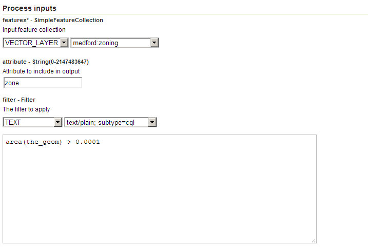

.. _processing.processes.vector.query:

Query
=====

Description
-----------

The ``gs:Query`` process queries a feature collection, using an optional filter expression to select a subset of the features. Optionally, a subset of the feature collection attributes can be specified to be returned. This process can be thought of as ebing equivalent to the following SQL statement type: ``SELECT...FROM...WHERE...``.

Inputs and outputs
------------------

This process accepts :ref:`processing.processes.formats.fcin` and returns :ref:`processing.processes.formats.fcout`.

Inputs
~~~~~~

.. list-table::
   :header-rows: 1

   * - Name
     - Description
     - Type
     - Required
   * - ``features``
     - Input features
     - :ref:`FeatureCollection <processing.processes.formats.fcin>`
     - Yes
   * - ``filter``
     - Filter to apply
     - String
     - No
   * - ``attribute``
     - Name of an attribute to include in the output
     - String
     - No

Outputs
~~~~~~~

.. list-table::
   :header-rows: 1

   * - Name
     - Description
     - Type
   * - ``result``
     - Output feature collection
     - :ref:`FeatureCollection <processing.processes.formats.fcout>`
     
Usage notes
-----------

* The ``filter`` can be specified using either XML Filter Encoding language or textual CQL language
* If no attributes are specified explicitly, then all input attributes are output

Examples
--------

The following example runs a query on the ``medford:zoning`` layer, using a CQL filter and the ``area`` filter function, to return large zoning parcels along with a subset of the attributes.

Input Parameters:

* ``features``: ``medford:zoning``
* ``filter``: ``area(the_geom) > 0.0001``
* ``attribute``: ``the_geom``
* ``attribute``: ``cityzoning``
* ``attribute``: ``zone``

:download:`Download complete XML request <xml/queryexample.xml>`.

   *gs:Query example parameters*

Relationship to other processes
-------------------------------

* The :ref:`gt:Transform <processing.processes.vector.transform>` process offers complementary functionality in that it allows attributes to be created or recomputed. The two processes can be chained to allow both filtering and computing of new attributes.

