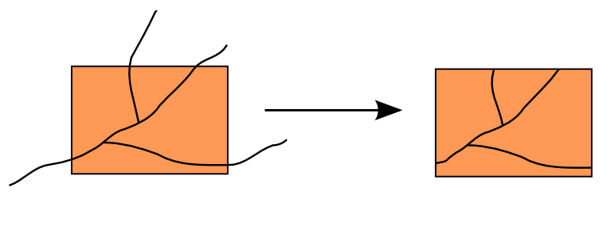
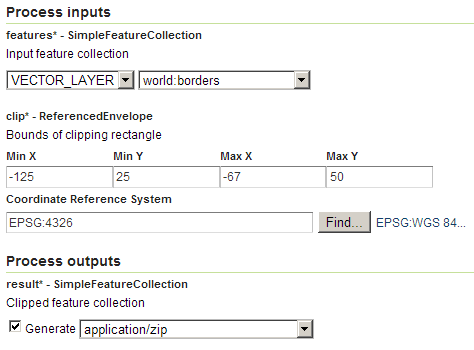

.. _processing.processes.vector.rectangularclip:

.. warning:: Document Status: **Requires copyedit review (MP)**

RectangularClip
===============

Description
-----------

The ``gs:RectangularClip`` process clips (crops) features to the specified rectangular extent. Attributes names and values are not affected by this process, and will be passed to the output feature collection without modification.

All features that intersect with the clipping rectangle will be returned with their geometries cropped in the output geometry. Any features that do not intersect with the clipping geometry will be eliminated from the output feature collection.

   *gs:RectangularClip*

Inputs and outputs
------------------

``gs:ReectangularClip`` accepts :ref:`processing.processes.formats.fcin` and returns :ref:`processing.processes.formats.fcout`.

Inputs
~~~~~~

.. list-table::
   :header-rows: 1

   * - Name
     - Description
     - Type
     - Usage
   * - ``features``
     - Input feature collection
     - :ref:`SimpleFeatureCollection <processing.processes.formats.fcin>`
     - Required
   * - ``clip``
     - Bounds of clipping rectangle
     - ReferencedEnvelope
     - Required

Outputs
~~~~~~~

.. list-table::
   :header-rows: 1

   * - Name
     - Description
     - Type
   * - ``result``
     - Clipped feature collection
     - :ref:`SimpleFeatureCollection <processing.processes.formats.fcout>`

Usage notes
-----------

* The output feature collection has the same :term:`CRS` of the input feature collection.
* The clipping rectangle can have  a different CRS. In that case, it will be reprojected into the CRS of the input collection before performing the clipping operation.

Examples
--------

The following example clips the ``world:borders`` feature collection to a rectangle that covers the continental part of the United States. 

Input parameters:
  
* ``features``: ``world:borders``
* ``clip``: 

  * ``minX``: -125
  * ``minY``: 25
  * ``maxX``: -67
  * ``maxY``: 50
  * ``CRS``: ``EPSG:4326`` 

:download:`Download complete XML request <xml/rectangularclipexample.xml>`.

   *gs:RectangularClip example parameters*

.. figure:: img/clipexample2.png

   *gs:RectangularClip example  output*

Related processes
-----------------

* The :ref:`gs:Clip <processing.processes.vector.clip>` process performs a similar clipping operation, but takes a geometry instead of a bounding box.

