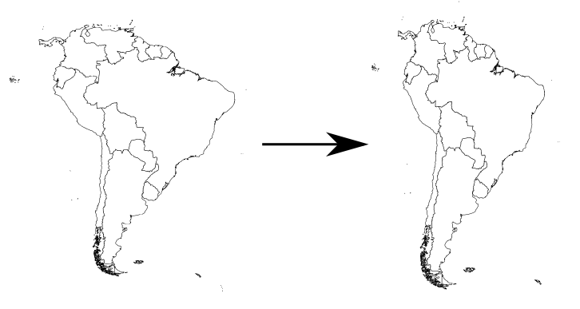
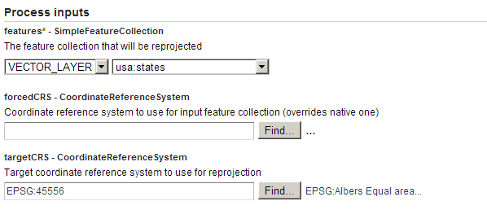
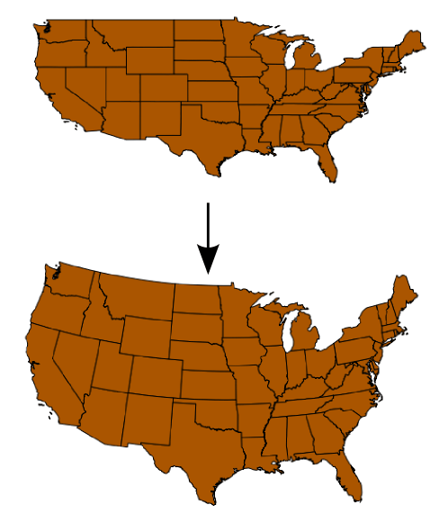

.. _processing.processes.vector.reproject:

.. warning:: Document Status: **Requires copyedit review (MP)**

Reproject
=========

Description
-----------

The ``gs:Reproject`` process reprojects the features in a feature collection to another :term:`CRS` from its original.

   *gs:Reproject*

.. note::

   For more information on available CRSs, see the following sites:

   * `EPSG Geodetic Parameter Dataset <http://www.epsg-registry.org>`_
   * `Spatial Reference <http://spatialreference.org>`_

Inputs and outputs
------------------

This process accepts :ref:`processing.processes.formats.fcin` and returns :ref:`processing.processes.formats.fcout`.

Inputs
~~~~~~

.. list-table::
   :header-rows: 1

   * - Name
     - Description
     - Type
     - Required
   * - ``features``
     - Input feature collection too reproject
     - SimpleFeatureCollection
     - Yes
   * - ``forcedCRS``
     - CRS to used instead of the original one of the input feature collection
     - CoordinateReferenceSystem
     - No
   * - ``targetCRS``
     - The CRS to reproject input features into. The resulting feature collection will use this CRS
     - CoordinateReferenceSystem
     - No     

Outputs
~~~~~~~

.. list-table::
   :header-rows: 1

   * - Name
     - Description
     - Type
   * - ``result``
     - The reprojected feature collection in the selected CRS
     - SimpleFeatureCollection

Usage notes
-----------

* A different origin CRS can be forced in case the native one is not correct.
* If no value is provided for the ``forcedCRS`` input parameter, the native CRS is used. The native CRS is ignored when a CRS is provided. This can be used to correct a wrongly assigned CRS for a given feature collection.
* The feature collection can contain geometries of any type.
* Attributes containing values that depend on the CRS (such as those depending on its units, like areas or lengths) are not modified, so they will need to be updated independently.

.. todo:: This note needs clarification: "Only the default geometries are reprojected. Other additional attributes containing geometries will not be reprojected. Attributes are copied directly from the input feature collection into the output feature collection, including those with geometries.""

Examples
--------

The following example shows the result of reprojection the ``usa:states`` feature collection from it original CRS (EPSG:4326) into the Albers Equal Area (EPSG:45556) one.

Input parameters:

* ``features``: ``usa:states``
* ``forcedCRS``:
* ``targetCRS``: ``EPSG:45556``

   *gs:Reproject example parameters*

:download:`Download complete XML request <xml/reprojectexample.xml>`.

   *gs:Reproject example output*

Related processes
-----------------

* This process is useful when working with multiple feature collections that all need to use the same CRS. Most overlay processes such as :ref:`gs:IntersectionFeatureCollection <processing.processes.vector.intersectionfc>` or :ref:`gs:InclusionFeatureCollection <processing.processes.vector.inclusionfc>` are of this kind. By using the ``gs:Reproject`` all feature collections can be reprojected into a common CRS so they can be used together.
* This process can be used to change the CRS of a feature collection from a geographic CRS into a projected CRS. This is useful for those processes in which a projected CRS is recommended, such as :ref:`gs:BufferFeatureCollection <processing.processes.vector.bufferfc>` process, where buffers drawn in a geographic CRS can become distorted.
* To reproject a single geometry, use the :ref:`gs:ReprojectGeometry <processing.processes.geometry.reprojectgeometry>` process instead.
