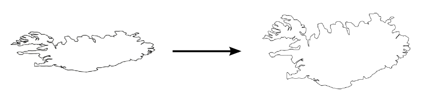
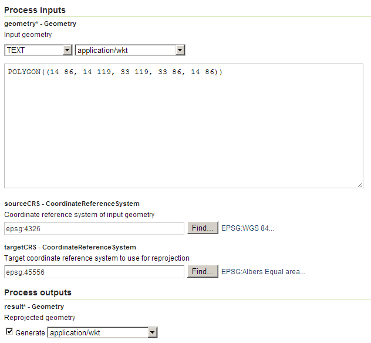

.. _processing.processes.geometry.reprojectgeometry:

.. warning:: Document Status: **Requires copyedit review (MP)**

ReprojectGeometry
=================

Description
-----------

The ``gs:ReprojectGeometry`` process reprojects a geometry from a given source :term:`CRS` into a new CRS.

   *gs:ReprojectGeometry*

.. note::

   For more information on available CRSs, see the following sites:

   * `EPSG Geodetic Parameter Dataset <http://www.epsg-registry.org>`_
   * `Spatial Reference <http://spatialreference.org>`_

Inputs and outputs
------------------

This process accepts :ref:`processing.processes.formats.geomin` and returns :ref:`processing.processes.formats.geomout`.

Inputs
~~~~~~

.. list-table::
   :header-rows: 1

   * - Name
     - Description
     - Type
     - Usage
   * - ``geometry``
     - Geometry to reproject
     - :ref:`Geometry <processing.processes.formats.geomin>`
     - Required
   * - ``sourceCRS``
     - Coordinate reference system of input geometry
     - CoordinateReferenceSystem
     - Required
   * - ``targetCRS``
     - Target coordinate reference system to use for reprojection.
     - CoordinateReferenceSystem
     - Required

Outputs
~~~~~~~

.. list-table::
   :header-rows: 1

   * - Name
     - Description
     - Type
   * - ``result``
     - The reprojected geometry in the selected CRS
     - :ref:`Geometry <processing.processes.formats.geomout>`

Usage notes
-----------

* The input geometry can be of any type.

Examples
--------

The following example transforms a rectangle representing an approximate bounding box of Mexico, from WGS84 (EPSG:4326) into the Albers Equal Area (EPSG:45556) CRS. The geometry definition is manually entered as a Well-Known-Text string.

Input parameters:

* ``geometry``: ``POLYGON((14 86, 14 119, 33 119, 33 86, 14 86))``
* ``sourceCRS``: ``EPSG:4326``
* ``targetCRS``: ``EPSG:45556``

   *gs:Reproject example parameters*

:download:`Download complete XML request <xml/reprojectgeometryexample.xml>`.

The resulting geometry, expressed as a WKT string, is the following one:

::

  POLYGON ((3682364.909421324 6683507.16058025, 5248436.316546583 6012965.425129825, 5591936.205924482 7108527.911748802, 3923368.4889155617 7452166.740974778, 3682364.909421324 6683507.16058025))

Related processes
-----------------

* To reproject a feature collection instead of a single geometry, use the :ref:`gs:Reproject <processing.processes.vector.reproject>` process instead.
