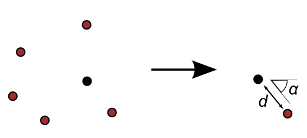
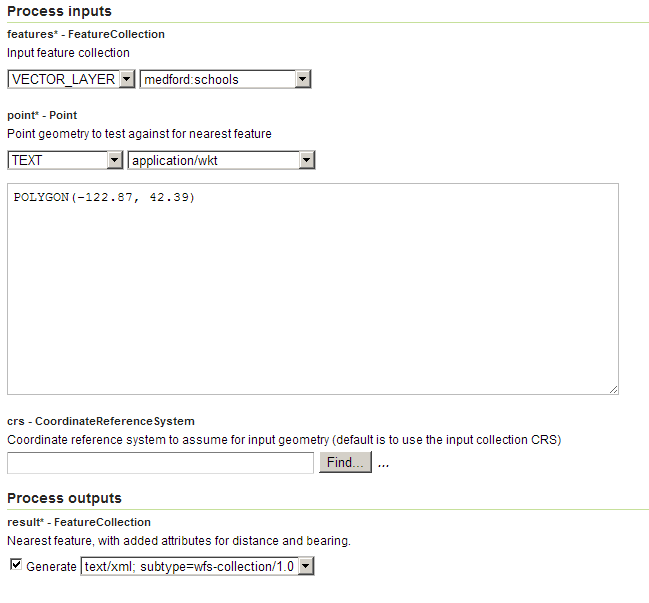

.. _processing.processes.vector.snap:

.. warning:: Document Status: **Requires copyedit review (MP)**

Snap
========

Description
-----------

The ``gs:Snap`` process computes the closest feature in a feature collection to a given point.

The output of the process is a new feature collection that contains just one point belonging to an input feature, closest to the given input point. Apart from the original attributes in the input feature collection, two new attributes are added to the output collection, named ``nearest_bearing`` and ``nearest_distance``, which contain the bearing and distance from the given point to the computed nearest point.

   *gs:Snap*

Inputs and outputs
------------------

``gs:Snap`` accepts :ref:`processing.processes.formats.fcin` and returns :ref:`processing.processes.formats.fcout`.

Inputs
~~~~~~

.. list-table::
   :header-rows: 1
   :widths: 25 35 20 20
   
   * - Name
     - Description
     - Type
     - Usage
   * - ``features``
     - Input features
     - :ref:`FeatureCollection <processing.processes.formats.fcin>`
     - Required
   * - ``point``
     - Point geometry to test agains for nearest feature
     - :ref:`FeatureCollection <processing.processes.formats.fcin>`
     - Required
   * - ``crs``
     - Coordinate reference system to assume for input point
     - CoordinateReferenceSystem
     - Optional

Outputs
~~~~~~~

.. list-table::
   :header-rows: 1

   * - Name
     - Description
     - Type
   * - ``result``
     - Feature collection with the nearest feature point
     - :ref:`FeatureCollection <processing.processes.formats.fcout>`

Usage notes
-----------

* If the ``crs`` parameter is not used, the coordinates of the input point are assumed to be in the same CRS as the input feature collection.
* The resulting distance in the ``nearest_distance`` attribute is expressed in miles.
* The ``nearest_bearing`` is expressed in degrees. 0 degrees represents East, and values increase clockwise.

Examples
--------
 
Finding the nearest school to a given point
~~~~~~~~~~~~~~~~~~~~~~~~~~~~~~~~~~~~~~~~~~~~~~~~~

This example shows how to calculate the closest school in the ``medford:schools`` layer, to a given point.

Input parameters:

  - ``features``: ``medford:school``
  - ``point``: ``POLYGON(-122.87, 42.39)``
  - ``crs``: [Blank]

The ``point`` is defined using a WKT string.

   *gs:Snap example parameters*

:download:`Download complete XMl request <xml/snapexample.xml>`.

The resulting feature collection contains a single point with coordinates (-122.908, 42.3796) and the following new attributes.

  - ``nearest_distance``: 2.1178
  - ``nearest bearing``: 173.1638

