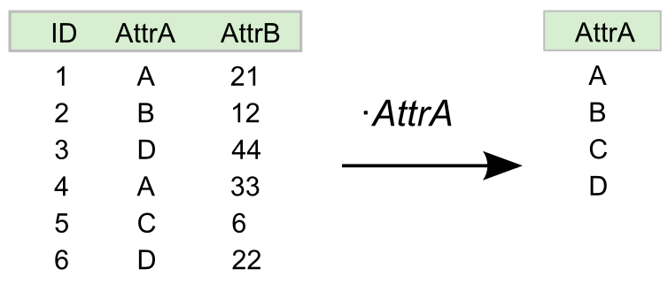
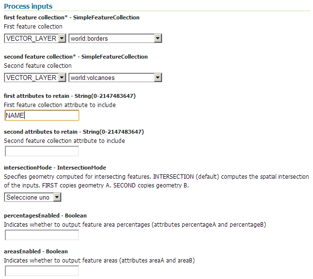
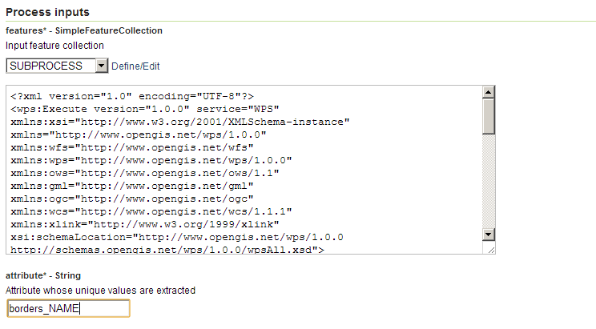

.. _processing.processes.unique:

.. warning:: Document Status: Requires technical review

Unique
==================

Description
-----------

The ``gs:Unique`` process returns the unique values for a given attribute in a feature collection. The result is a new feature collection with a single attribute named with the same name as the attribute select for extracting unique values. The feature collection contains as many feature as unique values for the selected field can be found in the original input feature collection.

   *gs:Unique*

Inputs and outputs
------------------

This process accepts :ref:`processing.processes.formats.fcin` and returns :ref:`processing.processes.formats.fcout` 

Inputs
^^^^^^

.. list-table::
   :header-rows: 1

   * - Name
     - Description
     - Type
     - Required
   * - ``features``
     - The input feature collection
     - :ref:`SimpleFeatureCollection <processing.processes.formats.fcin>`
     - Yes     
   * - ``attribute``
     - The attribute to consider for extracting unique values
     - String
     - Yes

Outputs
^^^^^^^

.. list-table::
   :header-rows: 1

   * - Name
     - Description
     - Type
   * - ``result``
     - The resulting feature collection of unique values
     - :ref:`SimpleFeatureCollection <processing.processes.formats.fcout>`

Usage notes
--------------  

* If the attribute selected is of type String, comparison between values is case-sensitive. Two values containing the same text, but with different case, will be counted as being different ones.

* The name of the attribute is case-sensitive.

Examples
----------

The following example shows how to get a feature collection with the names of the countries in which volcanoes can be found. First, the *world:volcanoes* and *world:borders* are intersected to get a feature collection of volcanoes, adding the name of the country they belong to. After that, the ``gs:Unique``  process is run on that feature collection to get the list of different country names.

Input parameter

* ``first feature collection``: ``world:borders``
* ``second feature collection``: ``world:volcanoes``
* ``first attributes to retain``: ``NAME``
* ``second attributes to retain``: 
* ``intersectionMode``: *SECOND*
* ``enableArea``: false
* ``enablePercent``: false

:download:`Download complete XML request <xml/uniqueexample.xml>`.

Input parameter
  - ``features``: Output from ``gs:IntersectionFeatureCollection``
  - ``attribute``: *borders_NAME*

