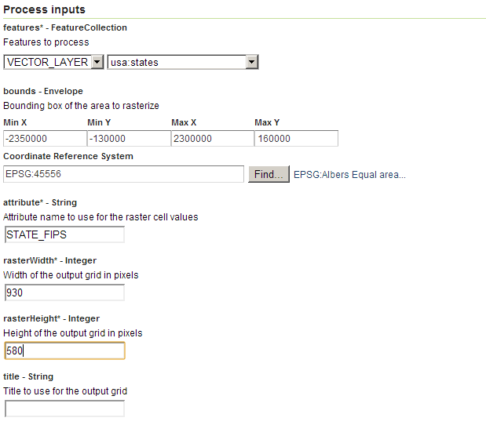

.. _processing.processes.vector.vectortoraster:

.. warning:: Document Status: **Requires copyedit review (MP)**

VectorToRaster
==============

Description
-----------

The ``gt:VectorToRaster`` process takes as input a feature collection and returns a raster. This process is know as **rasterization**. The values for the raster's grid elements are taken from an attribute in the input feature collection.

.. figure:: img/vectortoraster.png

   *gt:VectorToRaster*

Inputs and outputs
------------------

This process accepts :ref:`processing.processes.formats.fcin` and returns :ref:`processing.processes.formats.rasterout`.

Inputs
~~~~~~

.. list-table::
   :header-rows: 1

   * - Name
     - Description
     - Type
     - Required
   * - ``features``
     - Input collection to rasterize
     - :ref:`SimpleFeatureCollection <processing.processes.formats.fcin>`
     - Yes
   * - ``attribute``
     - Attribute from the feature collection to use as values in the output coverage
     - String
     - Yes     
   * - ``bounds``
     - Envelope representing the bounds of the output grid coverage
     - Envelope
     - No
   * - ``rasterWidth``
     - Width in cells of the output grid coverage
     - Integer
     - Yes
   * - ``rasterHeight``
     - Height in cells of the output grid coverage
     - Integer
     - Yes   
   * - ``title``
     - Name for the output coverage
     - String
     - No         

Outputs
~~~~~~~

.. list-table::
   :header-rows: 1

   * - Name
     - Description
     - Type
   * - ``result``
     - Output coverage containing the rasterized version of the input feature collection
     - :ref:`GridCoverage2D <processing.processes.formats.rasterout>`

Usage notes
-----------

* While this process is most often used with feature collections onatining polygons, this process can be used with geometries of all types.
* If the ``bounds`` parameter is omitted, the bounds are taken to be the same as the input feature collection.
* The :term:`CRS` needed to define the ``bounds`` parameter can be different from the :term:`CRS` of the input feature collection to rasterize. In this case, features will be reprojected first and then rasterized.
* The ``attribute`` value accepts not just the name of an attribute in the feature collection, but also `ECQL expressions <../../../geoserver/filter/ecql_reference.html>`_ that can be comprised of one or more attributes. 
* The attribute specified in the ``attribute`` value must be numeric or, if of type ``String``, it must contain numerical characters only such that it can be interpreted as a number. If using an `ECQL expression <../../../geoserver/filter/ecql_reference.html>`_, it must evaluate to a numerical value.
* The output coverage can contain only ``int`` and ``float`` values. Values of type ``Double`` in the feature collection will be converted to ``float``. Values of type ``Long`` will be converted to ``int``.
* Attribute names are case-sensitive, whether they are used alone or as part of a `ECQL expression <../../../geoserver/filter/ecql_reference.html>`_.
* Cells that are not covered by any of the rasterized geometries will have a no-data value.
* If several geometries overlap a given cell, that cell will get the value of the last geometry one to be rasterized. 

Examples
--------

The following example shows how to create a grid coverage from the ``usa:states`` feature collection. The values in the resulting grid coverage correspond to the unique identifier in the ``STATE_FIPS`` attribute. The extent and dimensions of the resulting coverage are calculated so as to make it cover the whole extent of the feature collection and have a cell size of 5000 meters square. The output coverage is in the Albers Equal Area projection (EPSG:45556).

Input parameters:

* ``features``: ``usa:states``
* ``attribute``: ``STATE_FIPS``
* ``bounds``:

  * ``minX``: -2350000
  * ``minY``: -1300000
  * ``maxX``: 2300000
  * ``maxY``: 1600000
  * ``CRS``: ``EPSG:45556``
  
* ``rasterWidth``: 930
* ``rasterHeight``: 580
* ``title``:

:download:`Download complete XML request <xml/vectortorasterexample.xml>`.

   *gt:VectorToRaster example parameters*

The following image shows a close up of the resulting grid coverage, along with the original feature collection, to illustrate the rasterization process and the differences between raster and vector version of a same polygon area.

.. figure:: img/vectortorasterexample.png

   *gt:VectorToRaster example output*

Related processes
-----------------

* This process is of interest when the input is a feature collection, but the intended process takes a raster as an input.
* The :ref:`gs:Bounds <processing.processes.vector.bounds>` process returns an envelope from a feature collection, so it can be used to define the bounds of the output grid coverage of the ``gt:VectorToRaster`` process. Use it to chain processes or just to know the extent of the input feature collection, in case you want to manually adjust it.
* In the case of polygons, this process is the inverse of the :ref:`gs:PolygonExtraction <processing.processes.raster.polygonextraction>` process, which converts a grid coverage into a polygon feature collection with polygons representing areas in the input grid coverage that have the same value.
* When rasterizing a feature collection comprised of points, most cells in the resulting layer are likely to have no data, unless the points are densely packed or the cell size (determined by the number of cells in the ``rasterWidth`` and ``rasterHeight`` parameters) is large. To create a grid coverage with values in all cells by using interpolation methods, use an interpolation process such as :ref:`gs:BarnesSurface <processing.processes.raster.barnessurface>`.

