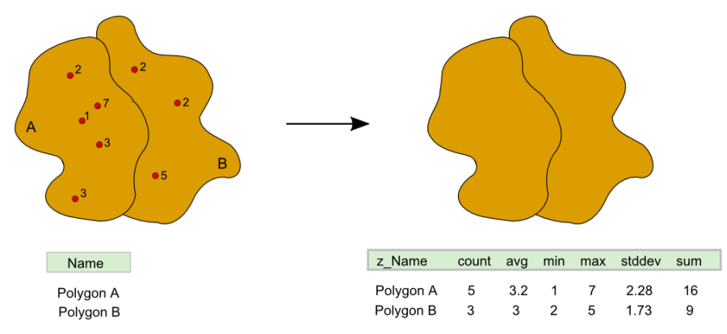
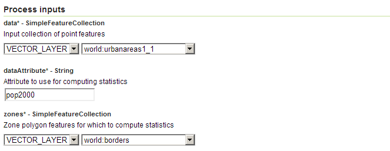
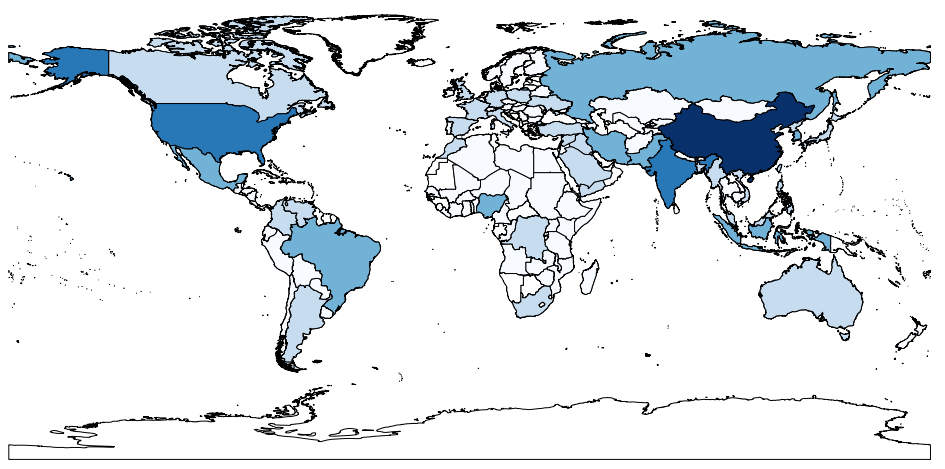
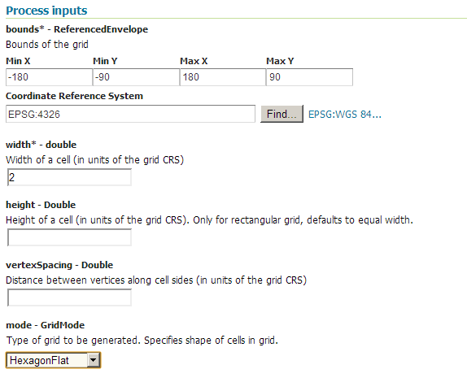
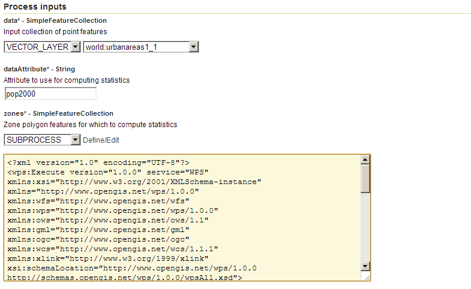
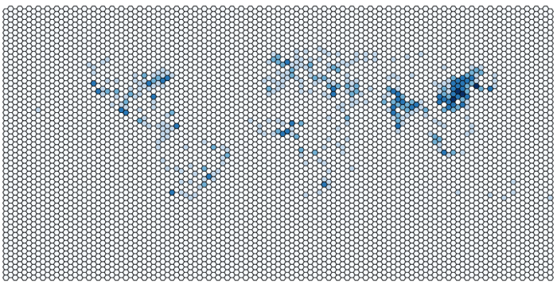

.. _processing.processes.vector.vectorzonalstats:

.. warning:: Document Status:  **Requires copyedit review (MP)**

VectorZonalStatistics
=====================

Description
-----------

The ``gs:VectorZonalStatistics`` process takes a points feature collection and a polygon feature collection and outputs a polygon layer with the same geometries as the input, but with additional attributes calculated from the points falling within each polygon. New attributes are computed using statistical parameters. The following statistics are computed:  **count**, **average**, **minimum value**, **maximum value**, **standard deviation**, and **sum**. 

With the exception of the **count**, calculation of statistics is done based on a given attribute in the input points layer.

   *gs:VectorZonalStats*

Inputs and outputs
------------------

This process accepts :ref:`processing.processes.formats.fcin` and returns :ref:`processing.processes.formats.fcout`.

Inputs
~~~~~~

.. list-table::
   :header-rows: 1

   * - Name
     - Description
     - Type
     - Required
   * - ``data``
     - Input collection of point features to calculate statistics from
     - :ref:`SimpleFeatureCollection <processing.processes.formats.fcin>`
     - Yes
   * - ``dataAttribute``
     - Name of attribute in the points layer to use for computing statistics
     - String
     - Yes
   * - ``zones``
     - Feature collection with polygon geometries where statistics are to be computed
     - :ref:`SimpleFeatureCollection <processing.processes.formats.fcin>`
     - Yes

Outputs
~~~~~~~

.. list-table::
   :header-rows: 1

   * - Name
     - Description
     - Type
   * - ``statistics``
     - Output polygon feature collection containing additional attributes
     - :ref:`SimpleFeatureCollection <processing.processes.formats.fcout>`

Usage notes
-----------

* The ``dataAttribute`` value is case-sensitive and should correspond to a numerical attribute.
* The output feature collection will contain the following computed attributes: ``count``, ``min``, ``max``, ``avg``, ``stddev``, and ``sum``.
* Original attributes copied over to the output feature collection are prefixed by ``z_``.  So for an attribute called ``name``, the resulting attribute would be ``z_name``.
* Misuse of the aggregation analysis is likely to occur if the attribute from the feature collection layer is not carefully selected. While attributes representing some kind of counting (such as a population attribute) will yield sound results, attributes representing other statistical parameters (such as an "average income" attribute) might result in incorrect or meaningless aggregated values, or statistical bias. This problem is closely related to the "`Ecological Fallacy <http://en.wikipedia.org/wiki/Ecological_fallacy>`_".

Examples
--------

Number of urban areas in each country
~~~~~~~~~~~~~~~~~~~~~~~~~~~~~~~~~~~~~

This example show how to calculate the number of urban areas in each country, using the ``world:urbanareas1_1`` and ``world:borders`` layers.

Input parameters:

* ``data``: ``world:urbanareas1_1``
* ``dataAttribute``: ``pop2000``
* ``zones``: ``world:borders``

   *gs:VectorZonalStatistics example #1 parameters*

:download:`Download complete XML request <xml/vectorzonalstatsexample.xml>`.

The following image shows the resulting feature collection, styled using the ``count`` attribute added, which represents the total number of urban areas within each country. While not shown, the remaining statistical attributes refer to the ``pop2000`` attribute in the input point feature collection, so the ``sum`` attribute would represent the total number of people living in urban areas in each country.

   *gs:VectorZonalStatistics example #1*

Urban areas aggregated on a hexagonal grid
~~~~~~~~~~~~~~~~~~~~~~~~~~~~~~~~~~~~~~~~~~

The next example shows the ``world:urbanareas1_1`` layer aggregated over a hexagonal grid, created with the :ref:`gs:Grid <processing.processes.vector.grid>` process.

Input parameters for ``gs:Grid``:

* ``bounds``
    
  * ``minX``:-180
  * ``maxX``: 180
  * ``minY``: -90
  * ``maxY``: 90
  * ``CRS``: ``EPSG:4326``

* ``width``: 2
* ``mode``: ``HexagonalFlat``

   *gs:VectorZonalStatistics example #2 parameters (part 1)*

Input parameters for ``gs:VectorZonalStatistics``:

* ``data``: ``world:urbanareas1_1``
* ``dataAttribute``: ``pop2000``
* ``zones``:  Output from ``gs:Grid`` process

   *gs:VectorZonalStatistics example #2 parameters (part 2)*

:download:`Download complete chained XML request <xml/vectorzonalstatsexample2.xml>`.

The resulting feature collection from the aggregation process is styled with a gradient color ramp based on the ``count`` attribute.

   *gs:VectorZonalStatistics example #2*

.. 3) The following example shows how to compute the total number of school students that can be expected to use each of the libraries in the ``medford:libraries`` feature collection. Computation is done in two steps. First, the influence area of each library (the area for which a given library is the closest one) is calculated using the ``gs:Voronoi`` process. Second, the resulting influence area feature collection is used as input to the ``gs:VectorZonalStatistics`` along with the ``medford:schools`` one. The ``students`` attribute is used to gather statistics. The new ``sum`` attribute reflects the total number of student from all the school that have a given library as their closest one.

.. image img/vectorzonalstastexample.png

.. The parameters for the ``gs:VectorZonalstatistics`` process are the following ones.

.. - ``data``: *medford:schools*
.. - ``dataAttribute``: *Students*
.. - ``zones``:  Output from ``gs:Voronoi`` process.

Related processes
-----------------

* The ``gs:RasterZonalStats`` process performs a similar analysis, but instead of a point feature collection, it takes a raster layer from which values are taken and analyzed.
